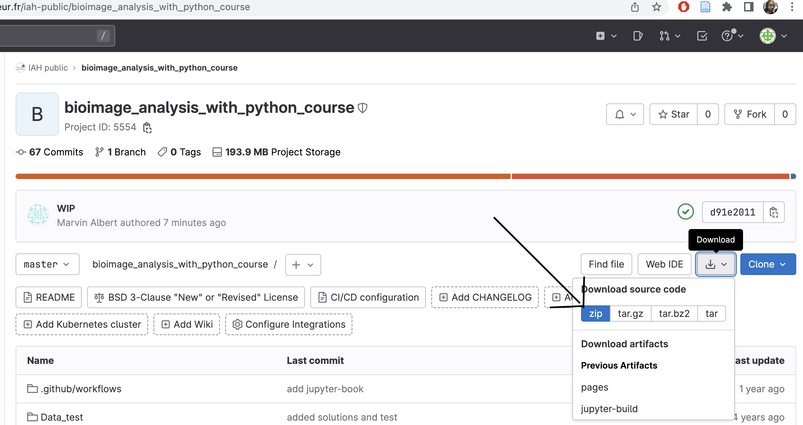
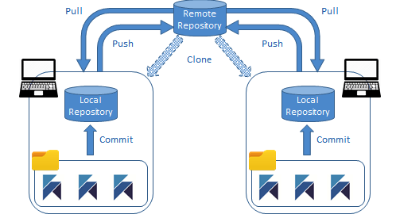

# Downloading the course material

## Downloading the notebooks and associated files
During this tutorial, we will be working through a set of notebooks. There are two ways to download the materials: download as a .zip or clone the repository. Follow the instructions below for either "downloading zip" (recommended for beginners) or "cloning via git".

### Downloading .zip
You can download the notebooks as a .zip file. To do so, please do the following:

1. Navigate your web browser to: [https://gitlab.pasteur.fr/iah-public/20241008_remote_python_bioimage_analysis_course_day2](https://gitlab.pasteur.fr/iah-public/20241008_remote_python_bioimage_analysis_course_day2)
2. Click the green "Code" button to open the download menu and then "Download ZIP"
    
3. Choose the location you would like to download the .zip.
4. Open your file browser and double click on the .zip file to uncompress it.
5. You have downloaded the materials!


### Cloning via git
You can use git to clone the repository containing the tutorial materials to your computer. We recommend cloning the materials into your Documents folder, but you can choose another suitable location. First, open your Terminal and navigate to the folder you will download the course materials into, e.g.

```bash
cd /home/<user>
```

and then clone the repository. This will download all of the files necessary for this tutorial.

```bash
git clone https://gitlab.pasteur.fr/iah-public/20241008_remote_python_bioimage_analysis_course_day2.git
```

### More about Git
Git is a version control system. A version control system (VCS) manages and tracks changes to files over time, allowing multiple users to collaborate efficiently on projects. It records a history of changes, supports branching for parallel work, and helps merge or resolve conflicts. It ensures a consistent project state and enables reverting to previous versions when needed. 



Image [source](https://hackolade.com/help/Teamcollaboration.html)
We could summarize the key principles of Git as follows: 

- **Tracking changes:** Git records a history of changes (commits) to a project, making it easy to review, undo, or revert to previous versions.

- **Branching and merging:** Developers can create branches to work on new features or fixes independently, then merge these changes back into the main project.

- **Collaboration:** Multiple users can work concurrently, and Git helps resolve conflicts when changes overlap.

- **Distributed:** Each user has a complete copy of the project history, enabling offline work and decentralization.


