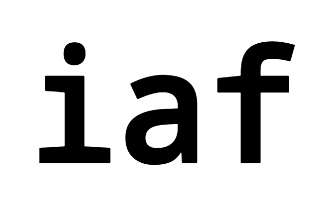
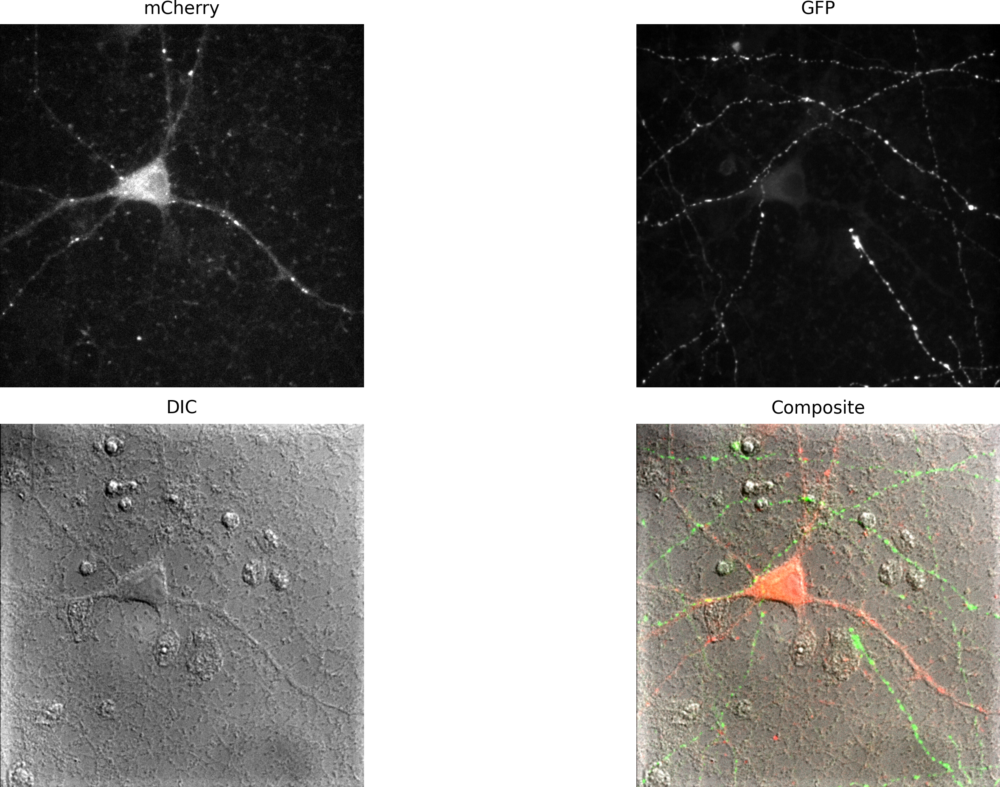
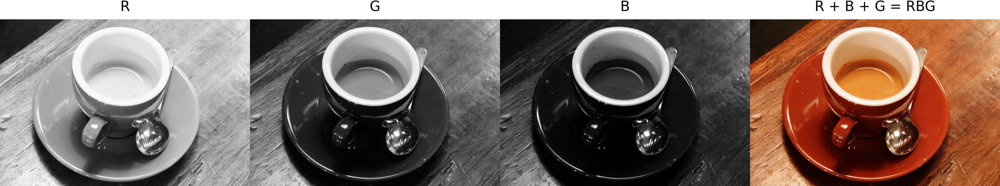
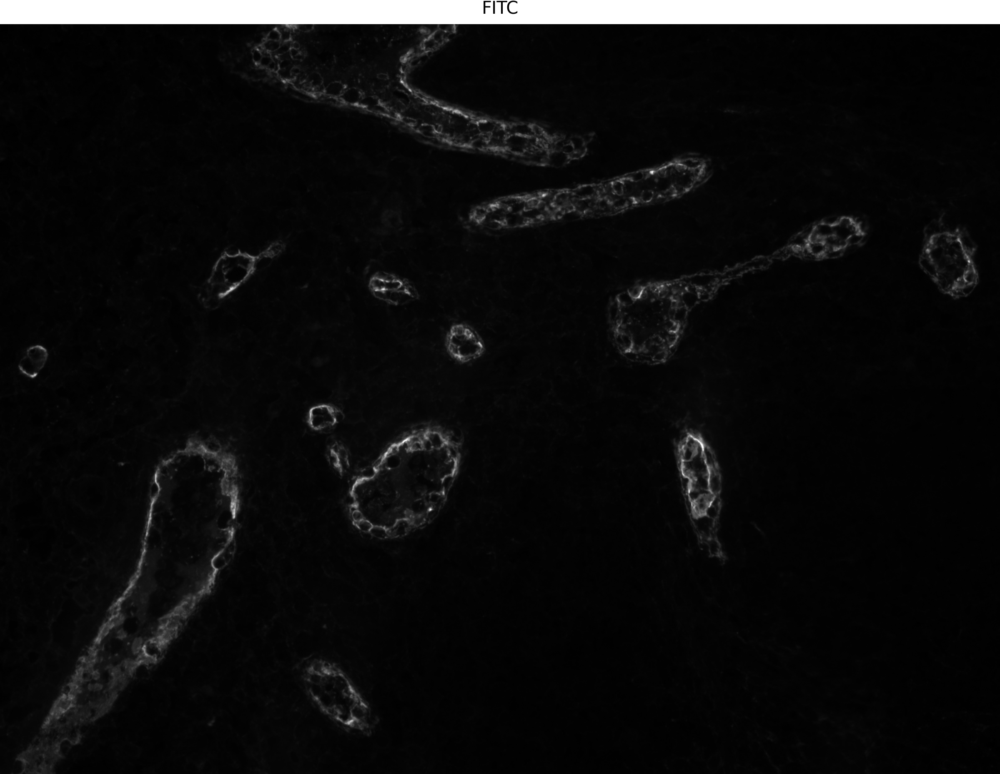
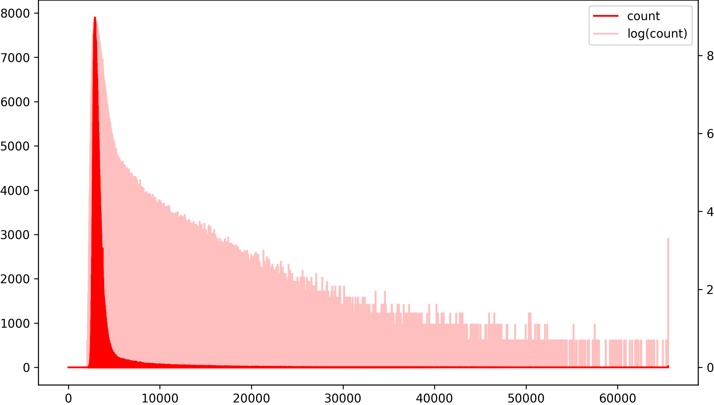
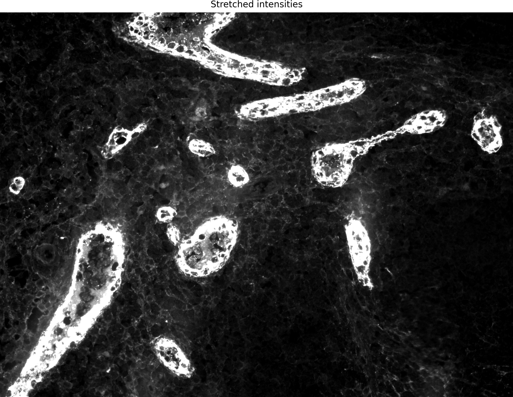
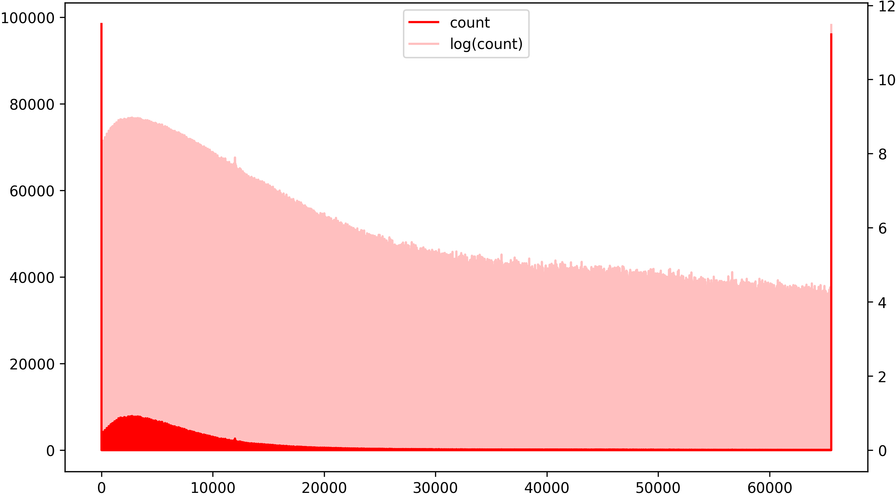
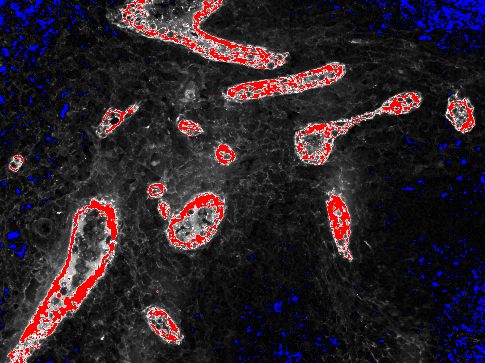

# 2. Image Handling

This section covers how to load, inspect, and manage image data in Python using common scientific libraries.


Among Python's most comprehensive, high-performance, and high-quality image processing libraries, we can count **scikit-image**, **scipy.ndimage**, **OpenCV**, **SimpleITK**, **Mahotas**, and **Pillow**. These libraries have a significant overlap in functionality but, depending on the specific application, each may be more performant or offer more and better algorithms than the others. In our course, we will predominantly use **scikit-image**, since it implements almost all algorithms we need to solve our image processing tasks and has excellent documentation, making it an ideal learning tool. However, we will complement it with scipy.ndimage and the small **iaf** library, which implements various commodity functions that simplify tasks that may be more complex to perform in scikit-image (and other libraries). In this section, we will give some information about scikit-image, scipy.ndimage and iaf. You can find more information on the other libraries in Appendix B.

## scikit-image


**scikit-image** is a collection of algorithms for image processing. It aims to be the reference library for scientific image analysis in Python and is available free of charge and without restrictions. One of the essential pillars of scikit-image's mission is to promote education in image processing by offering extensive pedagogical documentation.

### License

scikit-image is available free of charge under a very permissive license: [https://scikit-image.org/docs/dev/license.html](https://scikit-image.org/docs/dev/license.html).

### References

* Stéfan van der Walt, Johannes L. Schönberger, Juan Nunez-Iglesias, François Boulogne, Joshua D. Warner, Neil Yager, Emmanuelle Gouillart, Tony Yu and the scikit-image contributors. scikit-image: Image processing in Python. PeerJ 2:e453 (2014) [https://dx.doi.org/10.7717/peerj.453](https://dx.doi.org/10.7717/peerj.453)

### Documentation

**Website**: [https://scikit-image.org/](https://scikit-image.org/)

**Current documentation**: [https://scikit-image.org/docs/0.21.x/](https://scikit-image.org/docs/0.21.x/)

### Installation

The course Pixi environment already includes `scikit-image`. If you are maintaining your own Pixi workspace, install it with:

```bash
pixi add scikit-image
```

## scipy.ndimage


**SciPy** is an extensive library for mathematics, science, and engineering; **scipy.ndimage** is a package from SciPy that focuses on multidimensional image processing. Many functions in scikit-image are wrappers around the lower-level scipy.ndimage algorithms. 

### License

`SciPy` is available free of charge under the **BSD License (BSD)**: [https://github.com/scipy/scipy/blob/main/LICENSE.txt](https://github.com/scipy/scipy/blob/main/LICENSE.txt)

### Documentation

**Website**: [https://scipy.org/](https://scipy.org/)

**Current documentation**: [https://docs.scipy.org/doc/scipy/index.html](https://docs.scipy.org/doc/scipy/index.html)

### Installation

The course Pixi environment already includes `SciPy`. If you are maintaining your own Pixi workspace, install it with:

```bash
pixi add scipy
```

## iaf



`iaf` is a small helper library that simplify some operations that would otherwise be more verbose or complex in `scikit-image`, `Matplotlib`, and other libraries.

### License

`iaf` is released under the [BSD-3 Clause](https://opensource.org/licenses/BSD-3-Clause) license.

### Code and documentation

**Code**: [https://git.bsse.ethz.ch/pontia/iaf](https://git.bsse.ethz.ch/pontia/iaf)

**Current documentation**: [https://ia-res.ethz.ch/docs/iaf/index.html](https://ia-res.ethz.ch/docs/iaf/index.html)

## Basic concepts of image analysis

In the following sections, we will look at fundamental concepts and tools of image processing and analysis using the libraries presented in the previous section. You can follow along on the Jupyter notebook `code/python/notebooks/basic_concepts.ipynb`.

###  Data types

Images are addressed in computer memory as two- or three-dimensional arrays of pixel intensities. The third dimension may have different interpretations depending on the context. For example, for standard **RGB** images, the third dimension encodes the image's **R**(ed), **G**(reen), and **B**(lue) channels. However, in a microscopy experiment, the third dimension could store the emission intensity of fluorophores, the various planes of a three-dimensional acquisition, or a series of acquisitions in a time series.[^n-dim].

[^n-dim]: A multi-channel, multi-plane, multi-time point acquisition would need to be stored in a five-dimensional array!

scikit-image uses high-performance NumPy arrays to store and process images. Since image intensities are a quantized version of the original analog signal, the data type of the Numpy array is chosen to accommodate the number of gray values used to represent the **dynamic range** of the discretized signal. The following table summarizes a few commonly used detector dynamic ranges used in microscopy, the corresponding number of bits used by the computer to represent them, and the NumPy data type. Here, we only consider positive integer values[^signed], since they are most commonly found in digital images.

[^signed]: The `u` in `numpy.uint8` stands for `unsigned`. The corresponding `signed` data types are `numpy.int8` and `numpy.int16`, with the respective ranges `-128 .. 127` , and `-32768 .. 32767`.

| Detector dynamic range        | Computer dynamic range        | `NumPy` data type    |
|------------------------------|------------------------------|---------------------|
| 0, …, 255 (8 bits)           | 0, …, 255 (8 bits)           | `numpy.uint8`       |
| 0, …, 4095 (12 bits)          | 0, …, 65535 (16 bit)         | `numpy.uint16`      |
| 0, …, 65535 (16 bits)         | 0, …, 65535 (16 bits)        | `numpy.uint16`      |


When performing quantification, floating point values are required. Here, `NumPy` offers the types `numpy.float32` and `numpy.float64` (that corresponds to the native Python type `float`). Since real numbers can only be approximated by a finite number of bits, the possible range and the precision of the floating point data types differ. In both cases, small numbers can be approximated more precisely than large numbers.

|                            | `np.float32`                | `np.float64`                   |
|----------------------------|----------------------------|-------------------------------|
| Min value                  | -3.4028235e+38             | -1.7976931348623157e+308      |
| Max value                  | 3.4028235e+38              | 1.7976931348623157e+308       |
| Precision at 1.0 (eps)     | 1.1920929e-07              | 2.220446049250313e-16         |
| Precision at 1000.0        | 6.1035156e-05              | 1.1368683772161603e-13        |


The precision (or spacing) shows the minimum distance between two real numbers that will result in different binary representations. Smaller differences will collapse into the same bit sequence. For instance, if `a = 1000.0` is of type `float32`, the following holds true:

```python
a = np.float32(1000)
b = a + np.float32(1e-4)  # 1e-4 is larger than precision
b == a
```

```
False
```

```python
c = a + np.float32(1e-5)  # 1e-5 is smaller than precision
c == a
```

```
True
```

#### Limitations of bit representations

Operations on data types that cause values to overflow the boundaries of the data type that encodes them can be surprising and quite disruptive. Consider the following:

```python
a = np.uint8(10)
b = np.uint8(20)
a - b
```

```
246   # Ops!
```

A value of `-10` cannot be stored in a `numpy.uint8` data type. Hence, the negative value **wraps around** the dynamic range to give a value of `246` instead! Modern Python interpreters will warn us with a message like this:

```
<ipython-input-85-09bd029d0285>:1: RuntimeWarning: overflow encountered in ubyte_scalars
  a - b
```

but the overflow may go unnoticed in a production environment and cause serious trouble. When applying operations on integer values, then, it is a good defensive strategy to **cast** the data to floating point and, if necessary, cast it back to integer in the end.

```python
c = np.float32(a) - b   # Casting one is enough
c                       # c is of type np.float32
```

```
-10.0
```

When applying operations to images, we often want to clip the values that fall outside the dynamic range[^iinfo].

[^iinfo]: One can query the min and max value of integer types with `np.iinfo(np.uint8).min` and `np.iinfo(np.uint8).max`. The equivalent for floating point values is `np.finfo()`. The `iaf` library has two commodity functions [`iaf.io.cast.safe_to_uint8`](http://ia-res.ethz.ch/docs/iaf/io/cast/index.html#iaf.io.cast.safe_to_uint8) and [`iaf.io.cast.safe_to_uint16`](http://ia-res.ethz.ch/docs/iaf/io/cast/index.html#iaf.io.cast.safe_to_uint16) that perform safe casting for us.

```python
e = np.uint8([10, 20, 30])
f = np.uint8([20, 10, 15])
g = e.astype(np.float32) - f
g
```

```
array([-10.,  10.,  15.], dtype=float32)  # One negative value
```

```python
g[g < 0] = 0            # Set negative values to 0
g = g.astype(np.uint8)  # Cast back
```

```
array([ 0, 10, 15], dtype=uint8)
```

### Image reading and writing

For standard image file formats like `.tif` and `.png`, we can use the [`imread()`](https://scikit-image.org/docs/dev/api/skimage.io.html#skimage.io.imread) function from `scikit-image`, as in the following example:

```python
from skimage.io import imread

img = imread("image.tif")
print(img.shape, img.dtype)
```

```
(1068, 1212) uint16
```

To write an image back to disk, we can use:

```python
from skimage.io import imsave

imsave("out_image.tif", img)
```

For proprietary file formats like Nikon `.nd2`, there are a few Python libraries that we can use. Here, we will use the `iaf` library, that provides the [`NikonND2Reader`](https://ia-res.ethz.ch/docs/iaf/io/readers/index.html#iaf.io.readers.NikonND2Reader):

```python
from iaf.io.readers import NikonND2Reader

reader = NikonND2Reader("file.nd2")
reader
```

```
NikonND2Reader("file.nd2")
  - Dimensions: (v=7, t=1, c=2, z=6, y=1024, x=1024)
  - Voxel size: (x=0.519600, y=0.519600, z=4.955000)
  - Series geometry: "czyx"
```

This example ND2 file contains `v=7` series (*e.g.*, stage positions). We can load the first series (`v=0`) with:

```python
stack = reader[0]
stack.shape 
```

```
(2, 6, 1024, 1024)  # c, z, y, x
```

To iterate over all series in the file, we can use:

```python
for img in reader:
    print(img.shape, img.mean()) 
```

```
(2, 6, 1024, 1024) 82.52957439422607
(2, 6, 1024, 1024) 112.75271670023601
(2, 6, 1024, 1024) 117.6698609193166
(2, 6, 1024, 1024) 117.19015145301819
(2, 6, 1024, 1024) 151.8092711766561
(2, 6, 1024, 1024) 138.3780381679535
(2, 6, 1024, 1024) 155.3497955004374
```

The `reader` objects exposes metadata information via properties:

| Property              | Explanation                                            |
|----------------------|--------------------------------------------------------|
| `reader.channel_names` | Tuple of names for each of the acquisition channels   |
| `reader.filename`      | Full file name of the opened file                      |
| `reader.geometry`      | Geometry for each series                                |
| `reader.iter_axis`     | Axis over which the iteration occurs (one of `"v"` or `"t"`) |
| `reader.metadata`      | Processed file metadata (dictionary)                   |
| `reader.num_channels`  | Number of channels                                     |
| `reader.num_planes`    | Number of planes (z levels)                            |
| `reader.num_series`    | Number of series (acquisitions) in the file           |
| `reader.num_timepoints`| Number of time points                                  |
| `reader.voxel_sizes`   | Voxel sizes in units (µm) `(x, y, z)`                  |


Please notice that if a file contains more than one series, the reader will iterate over series, and `iter_axis` will be `"v"`. Otherwise, the reader will iterate over time points, and `iter_axis` will be `"t"`. `"v"` and `"t"` are the only iteration axes supported. In both cases, the `geometry` property will indicate the dimensionality of the **array** returned by the iterator (*e.g.*, if `geometry` is `"czyx"`, the retuned data will be a multi-channel 3D stack of images, with the first dimension being the channel `c` and the second the plane `z`).

### Colors

In this course, we will focus on gray-value images that represent the intensity of some signal (for instance, fluorescence emission). The only information stored in such an image is the intensity of the original signal at each pixel position. By default, intensity images are displayed as gray-scale images with black pixels mapped to the intensity 0 and white pixels mapped to $255$ (for 8-bit images) or $65535$ (for 16-bit images). 

Even with gray-value images, we may sometimes use color to assign specific meaning to pixels or emphasize spatial relationships between different images. For example, in the panel below, `mCherry`, `GFP`, and `DIC` are three intensity images corresponding to two **fluorescence** and one **differential-interference-contrast** microscopy acquisition. The intensity value at each location is proportional to the strength of the emitted signal collected at that pixel and therefore carries quantitative value. Since `mCherry`, `GFP`, and `DIC` are three views of the same underlying sample (a neuron), we can increase their information content by assigning different colors and combining them into a **composite image** that helps visualize the spatial relation of the three channels. The `iaf` library offers the [`iaf.color.to_composite()`](http://ia-res.ethz.ch/docs/iaf/color/index.html#iaf.color.to_composite) to easily compose images. If `mcherry`, `gfp` and `dic` are three NumPy arrays containing the corresponding gray-value images, we can create a composite as follows:

```python
from iaf.color import to_composite

cmp = to_composite(
    images=(mcherry, gfp, dic),
    colors=(Color.Red, Color.Green, Color.Gray)
)
```



In contrast to composite images, **RGB images** use a weighted sum of the three components **R**(ed), **G**(reen), and **B**(lue) to represent up to $256^3=16,777,216$ different colors. The intensity of each of the three channels does not represent any physical quantity; it is just one of the three components of the $(r, g, b)$ tuple that represents a specific color for each pixel location.



### Histogram and histogram operations

Many fluorescence microscopy images tend to be predominantly background. The signal of interest is confined to smaller patches of brighter pixels. In the `FITC` image below, only cell membranes are fluorescently labeled, the signal is of low contrast, and details are difficult to appreciate.




The histogram of the `FITC` image below reveals that the vast majority of pixels have a very low intensity as expected since they are part of the image's background. The actual signal intensities are few and scattered over the whole range of the dynamic range. We can calculate the histogram of an image in `scikit-image` using the [`histogram()`](https://scikit-image.org/docs/dev/api/skimage.exposure.html#skimage.exposure.histogram) function from `skimage.exposure`.

```python
from skimage.exposure import histogram

# Calculate the histogram over the data type source range
n, b = histogram(img, source_range="dtype")

# Calculate the log of the counts
norm_log_n = np.log(1.0 + n)
```

In the plot below, the solid red area shows the raw pixel intensity counts, while the superimposed semi-transparent area shows the logarithm of those counts. The logarithmic plot is handy for studying the distribution of the actual signal intensities in images that are dominated by the background. In particular, it helps spot cases of **signal saturation**. In an adequately quantized signal, the intensity counts should decay and reach zero well before reaching the maximum of the dynamic range. The dynamic range of the physical detector (*such as* the camera pixel) and the data type used to store the discretized signal (such as 8- or 16-bit integers) define the maximum intensity range of the final image. If the (log) histogram shows residual counts for the highest bin or even a suspiciously high peak, as in the plot below, we know that some of the highest signal intensities have been **saturated**.



It is common to apply a **linear stretch** to the image intensities (a point operation) to increase the contrast in the image. Importantly, this is usually done only to enhance the visual clarity of the image and to accommodate the poor gray-value resolution of the human eyes: the original pixel intensities are **not permanently modified**! This fact is fundamental if we plan to use the image for quantitative analysis. In some (rare) cases, a linear stretch across a series of images is safe and justified. For example, many cameras have a dynamic range of 12 bits ($0 ... 4095$), but the acquired images are stored with 16-bit dynamic range[^twelve_bits]. A linear stretch from 12 to 16 bits will not cause any loss of information and will still allow quantitative comparison across images (down to a constant multiplicative factor).

[^twelve_bits]: 12 bits correspond to 1.5 bytes. That is 4 bits of every second byte must be split among the neighbor bytes to calculate the correct intensity of the pixel they encode it. While this is certainly possible, it adds computational complexity and is avoided by *wasting* 4 bits for every pixel.

The simplest variant of linear stretch shifts the image towards zero by subtracting the minimum value and then stretches the histogram to cover the whole extent of the image's dynamic range. This operation can be done without loss of information if the range used to rescale the image contains all intensities in the starting image. For a 16-bit image, this would be:
```{math}
I_{s} = 65535 \cdot \frac{I - \textrm{min}(I)}{\textrm{max}(I)-\textrm{min}(I)}
```
In `scikit-image`, this can be easily done as follows[^normalizing_explicitly]:

[^normalizing_explicitly]: As an exercise, try implementing it using `NumPy` operations only.

```python
from skimage.exposure import rescale_intensity

# Rescale between min(img) and max(img)
img_s = rescale_intensity(img)
```

It is common to use some percentile of the intensities to drop outliers (such as *dead* or *hot* pixels). We can pass an additional argument to [`rescale_intensity()`](https://scikit-image.org/docs/stable/api/skimage.exposure.html#skimage.exposure.rescale_intensity) that explicitly sets the lower and upper bound for normalization:

```python
# Use the 5th and 95th intensity percentile
vmin, vmax = np.percentile(img, (5, 95))
img_s = rescale_intensity(img, (vmin, vmax))
```

The stretched image now looks like this:



The [`imshow()`](http://ia-res.ethz.ch/docs/iaf/plot/index.html#iaf.plot.imshow) function from `iaf.plot` displays images with control on the intensity stretching via its `auto_stretch` and `clip_percentile` arguments, and without modifying the original image:

```python
imshow(img, auto_stretch=True, clip_percentile=5.0)
```

The contrast in the cell membrane has definitely increased. However, if we plot the histogram and the logarithm of the histogram of the stretched image, we see that both low and high intensities are now heavily saturated.



A very helpful tool to visualize the saturated pixels in the image is the **Hi-Lo** look-up table. Using [`iaf.color.get_hilo_cmap()`](http://ia-res.ethz.ch/docs/iaf/color/index.html#iaf.color.get_hilo_cmap), we can easily spot the saturated pixels as follows:

```python
from iaf.color import get_hilo_cmap

imshow(img_s, cmap=get_hilo_cmap(65535))
```




The blue pixels saturate the lower bound of the dynamic range (that is, they have $0$ intensity), while the red pixels saturate the upper bound (and have, in this case, an intensity of $65535$). Beware of using such images for any quantitative analysis! 
