# Image Processing

This section introduces classical image processing techniques such as filtering, thresholding, morphological operations and watershed segmentation.


## Filters

Images are filtered in the spatial domain by the convolution operation with a kernel whose weights are carefully selected to perform a specific transformation on the image's pixel. We will look at some examples using the `actin.tif` image below.

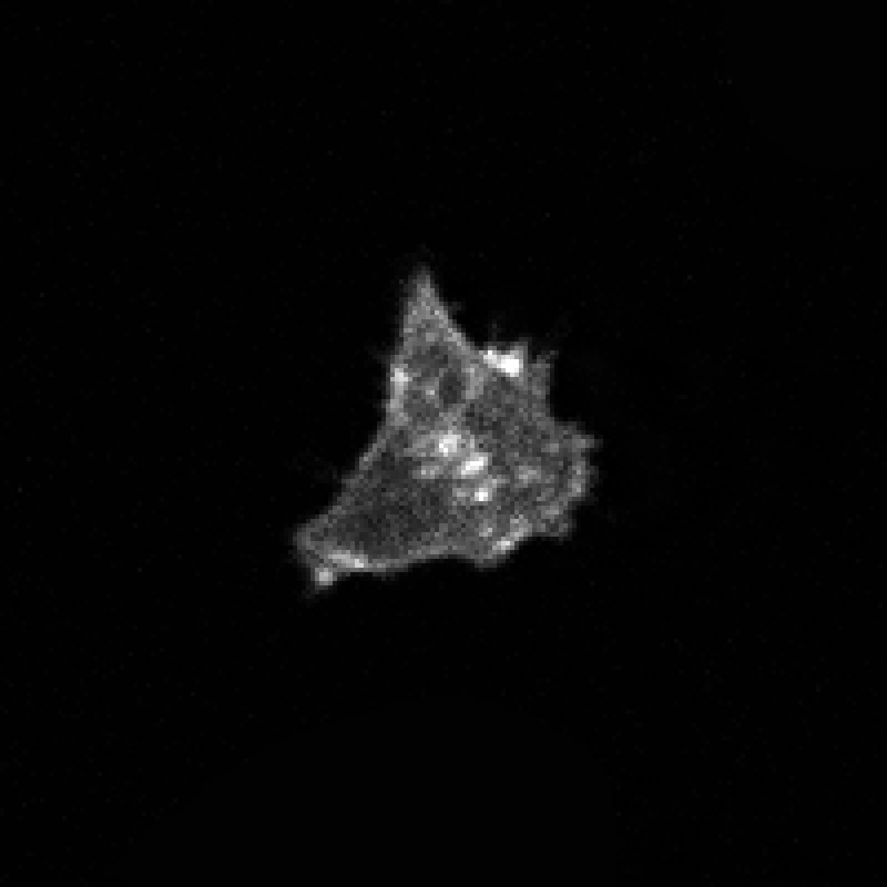


### Average filter

We will start by running an average filter on the `actin.tif` image by defining our own $5x5$ kernel. We need a filter with homogeneous weights that sum up to 1.0.
$$
h = \frac{1}{25}\cdot
\begin{bmatrix}
    1 & 1 & 1 & 1 & 1 \\
    1 & 1 & 1 & 1 & 1 \\
    1 & 1 & 1 & 1 & 1 \\
    1 & 1 & 1 & 1 & 1 \\
    1 & 1 & 1 & 1 & 1
\end{bmatrix}
= 
\begin{bmatrix}
    \frac{1}{25} & \frac{1}{25} & \frac{1}{25} & \frac{1}{25} & \frac{1}{25}\\
    \frac{1}{25} & \frac{1}{25} & \frac{1}{25} & \frac{1}{25} & \frac{1}{25}\\
    \frac{1}{25} & \frac{1}{25} & \frac{1}{25} & \frac{1}{25} & \frac{1}{25}\\
    \frac{1}{25} & \frac{1}{25} & \frac{1}{25} & \frac{1}{25} & \frac{1}{25}\\
    \frac{1}{25} & \frac{1}{25} & \frac{1}{25} & \frac{1}{25} & \frac{1}{25}
\end{bmatrix}
$$
In Python (using `NumPy`), we can define the kernel as follows:

```python
k_5x5 = 1/25 * np.array([
    [ 1.0, 1.0, 1.0, 1.0, 1.0],
    [ 1.0, 1.0, 1.0, 1.0, 1.0],
    [ 1.0, 1.0, 1.0, 1.0, 1.0],
    [ 1.0, 1.0, 1.0, 1.0, 1.0],
    [ 1.0, 1.0, 1.0, 1.0, 1.0]
], dtype=np.float32)
```

or, more concisely:

```python
k_5x5 = 1/25 * np.ones((5, 5), dtype=np.float32)
```

For comparison, we also create a filter with larger support:

```python
k_9x9 = 1/81 * np.ones((9, 9), dtype=np.float32)
```

We apply the average filter by using the [`convolve()`](https://docs.scipy.org/doc/scipy/reference/generated/scipy.ndimage.convolve.html) function from `scipy.ndimage`.

```python
from scipy.ndimage import convolve

img_f_5x5 = convolve(img, k_5x5)
img_f_9x9 = convolve(img, k_9x9)
```

The results are shown in the figure below. Notice how kernels with larger support tend to blur the image stronger.

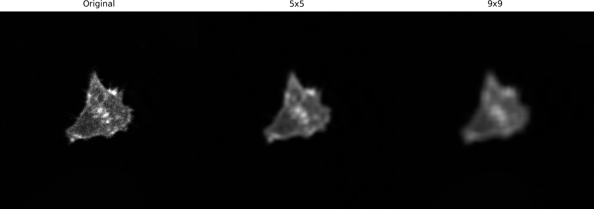

### Gaussian filter

In contrast to the average filter, the Gaussian filter is better at preserving features of a given scale (or size). The support of the Gaussian kernel smoothly decays with the distance from the center pixel. The weights of the Gaussian kernel are calculated as follows:
$$
G=e^{-\frac{x^{2}+y^{2}}{2\sigma^{2}}}
$$
We can discretize the Gaussian filter explicitely:

```python
In [1]: def gauss_2d(size, sigma):
    cy = size[0] // 2
    cx = size[1] // 2
    out = np.zeros(size, dtype=np.float32)
    for y in range(-cy, cy + 1):
        for x in range(-cx, cx + 1):
            r = y + cy
            c = x + cx
            out[r, c] = np.exp(-1.0 * ((x ** 2 + y ** 2) / (2 * sigma ** 2)))
    return out
```

and then apply it with the `convolve()` function as shown above. In practice, however, we will use the [`gaussian()`](https://scikit-image.org/docs/dev/api/skimage.filters.html#skimage.filters.gaussian) function from `scikit.filters`:

```python
from skimage.filters import gaussian

img_f_gs1 = gaussian(img, sigma=1.0)
img_f_gs3 = gaussian(img, sigma=3.0)
```

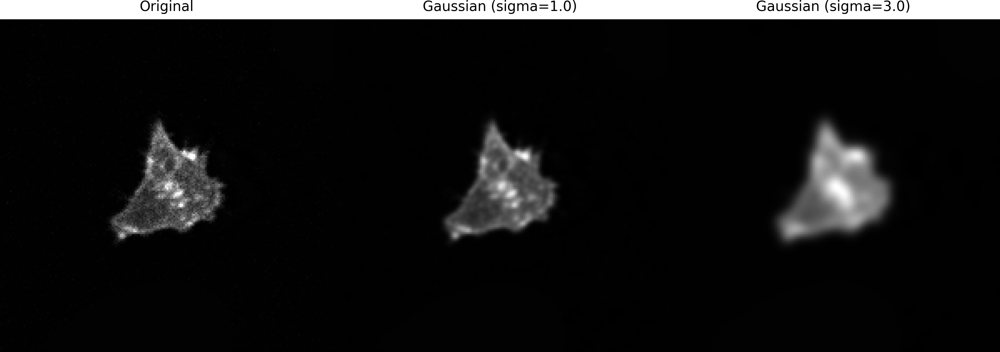

Higher values of `sigma` result in stronger smoothing of the image. Ideally, `sigma` should be chosen to match the size of the features of interest in the image or to suppress features (that is, noise) that is smaller than the support of the kernel.

### Image derivatives as filters

Image derivatives can be approximated in a series of ways. Here, we will calculate the horizontal and vertical derivative by convolving the image with the `sx` and `sy` kernels defined below[^sobel].

[^sobel]: A  slightly better (but still rather crude) approach is the Sobel operator, with kernels $G_{x} = \begin{bmatrix}1 & 0 & -1 \\ 2 & 0 & -2 \\ 1 & 0 & -1\end{bmatrix}$ and its transpose $G_{x} = \begin{bmatrix}1 & 2 & 1 \\ 0 & 0 & 0 \\ -1 & -2 & -1\end{bmatrix}$.

```python
k_sx = np.array([
    [1, 0, -1],
    [1, 0, -1],
    [1, 0, -1]
], dtype=np.float32)

# k_sy is the transpose of k_sx
k_sy = k_sx.T

img_f_sx = convolve(img.astype(np.float32), k_sx)
img_f_sy = convolve(img.astype(np.float32), k_sy)
```

Vertical edges are preserved predominantly by `sx` and horizontal edges are preserved predominantly by `sy`. Edges at angles close to 45º have similar responses with both filters.


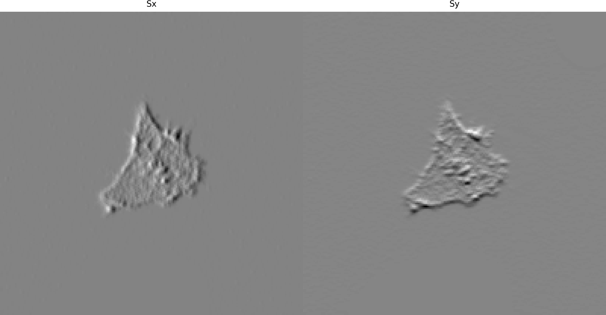

The Laplacian is a discretization of the second-order derivative of the image and highlights regions of rapid intensity change. Two commonly used kernels are $\begin{bmatrix}
    0 & -1 & 0 \\
    -1 & 4 & -1 \\
    0 & -1 & 0
\end{bmatrix}$ and $\begin{bmatrix}
    -1 & -1 & -1 \\
    -1 & 8 & -1 \\
    -1 & -1 & -1
\end{bmatrix}$. Notice that these kernels are the negative of the correct discretization of the Laplacian, to avoid flipping the image intensities. Similarly to the first derivative filters above, the Laplacian is often used for edge, but also for blob detection. Since it is highly sensitive to noise, it is usually combined with a smoothing step by a Gaussian kernel. The combined Laplacian of Gaussian kernel can be pre-calculated as follows:
$$
\textrm{LoG}=-\frac{1}{\pi\sigma^{4}}\left[1-\frac{x^{2}+y^{2}}{2\sigma^{2}}\right]e^{-\frac{x^{2}+y^{2}}{2\sigma^{2}}}
$$

To discretize and apply the LoG we make use of the [`gaussian_laplace()`](https://docs.scipy.org/doc/scipy/reference/generated/scipy.ndimage.gaussian_laplace.html) function from `scipy.ndimage` (again, notice below the `-1.0` to flip the sign of the Laplacian).

```python
from scipy.ndimage import gaussian_laplace

img_f_log = -1.0 * gaussian_laplace(img.astype(np.float32), sigma=2.0)
```

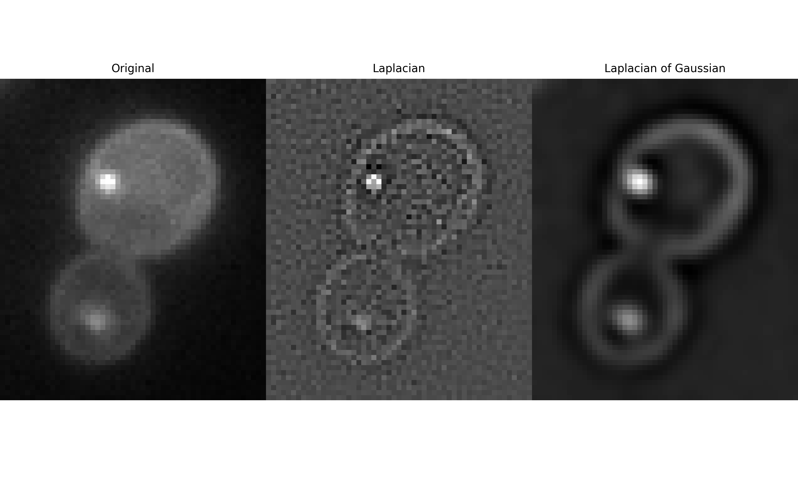


The Laplacian of Gaussian is more robust to noise that the simple Laplacian and enhances features at the scale `sigma` of the Gaussian kernel.

### Linear vs. non-linear filters

Non-linear filters cannot be implemented by the convolution operator since, as their name implies, they do not perform any linear operation (*i.e.*, additions and multiplications) on the pixel neighborhood. For specific applications, however, non-linear filters may display higher performance than linear filters. To investigate this, we will use two versions of a reasonably high-SNR image that we perturb with either **salt & pepper** noise (to simulate a camera with *dead* or *hot pixels*) or **Gaussian** noise (to simulate a camera with important dark or read-out noise). We use the **peak SNR** value (in dB) as a single number to represent the difference in quality between the original image and either the noisy or filtered version. 

The pSNR is defined as:
$$
\textrm{pSNR}=20 \cdot \log_{10}{\textrm{MAX}_{I}}-10 \cdot \log_{10}{\textrm{MSE}}
$$

where:

$$
\textrm{MSE}=\frac{1}{mn}\sum_{i=0}^{m-1}\sum_{j=0}^{n-1}\left[I(i, j	-K(i, j)\right]^2
$$


and $\textrm{MAX}_{I}$ is the maximum possible value of the data range of image $I$ ($255$ for 8-bit and $65535$ for 16-bit images).

We use the pSNR implementation from the [`peak_signal_noise_ratio()`](https://scikit-image.org/docs/dev/api/skimage.metrics.html#skimage.metrics.peak_signal_noise_ratio) function defined in `skimage.metrics`.


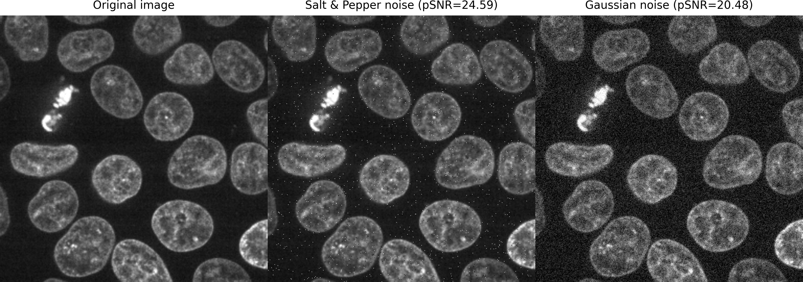


The salt & pepper noise image has a higher pSNR because even though the noisy pixels are very different in intensity from the original image, they are much fewer than in the Gaussian noise image.

Salt & pepper noise is best suppressed using a median filter. The median filter replaces the intensity at the center of the neighborhood with the median of their intensities. This approach is perfect for removing individual outliers (such as hot pixels). Indeed, the pSNR of the median-filtered version of the salt & pepper noise image is $41.40$ against $33.58$ for the Gaussian filter. The Gaussian filter spreads the intensities of the noisy pixels to the neighboring pixels, reducing but not suppressing the noise (and reducing the signal strength).

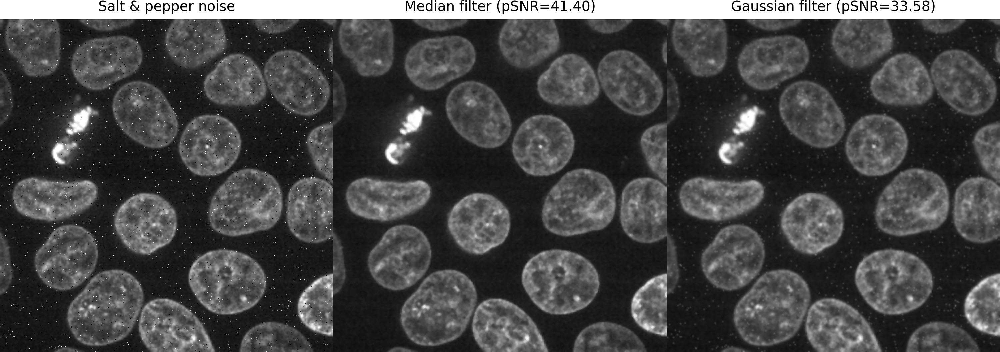

If the starting image is perturbed by Gaussian noise, the Gaussian filter is the preferred approach. The median filter is inferior in quality ($27.45$ against $30.46$) and has the additional inconvenience of being much more computationally expensive. For small 2D images, this difference may be negligible, but for large 3D datasets, the computation time may become prohibitive. Faster approximations of the median filter have been developed, but the performance of the Gaussian filter is still vastly superior.

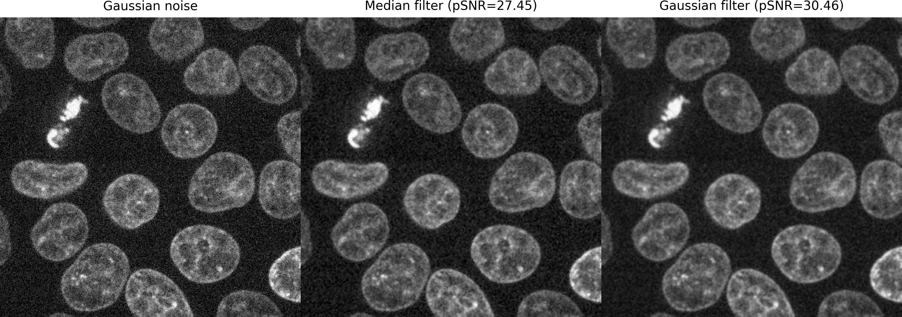

## Segmentation (intensity based)

When performing quantitative image analysis, we want to extract objects from images to measure several features we can use to test some hypotheses. It is then crucial to preserve their shapes as faithfully as possible. For a robust segmentation, the objects of interest would ideally have an intensity significantly higher than their local background. In the example image below, the cell body and the neuron axons have a stronger intensity than the image background. However, the axons are weaker than the cell body.

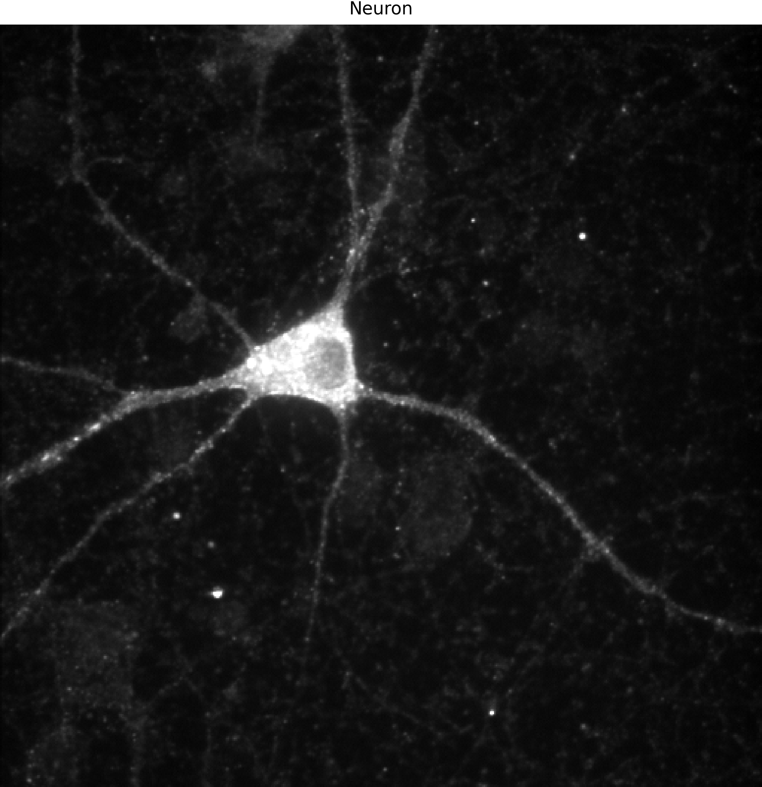

Different segmentation algorithms may give different segmentations of the same signal. As an example, the plot below shows the histogram of the image intensities in red, and the threshold value estimated by the **Otsu** ([`threshold_otsu()`](https://scikit-image.org/docs/dev/api/skimage.filters.html#skimage.filters.threshold_otsu)), **Li** ([`threshold_li()`](https://scikit-image.org/docs/dev/api/skimage.filters.html#skimage.filters.threshold_oli)), and **Triangle** ([`threshold_triangle()`](https://scikit-image.org/docs/dev/api/skimage.filters.html#skimage.filters.threshold_triangle])) algorithms. 

The algorithms are implemented in the `skimage.filters` package, and can be used as follows:

```python
from skimage.filters import threshold_otsu, threshold_li, threshold_triangle

th_ot = threshold_otsu(img)
th_li = threshold_li(img)
th_tr = threshold_triangle(img)
```

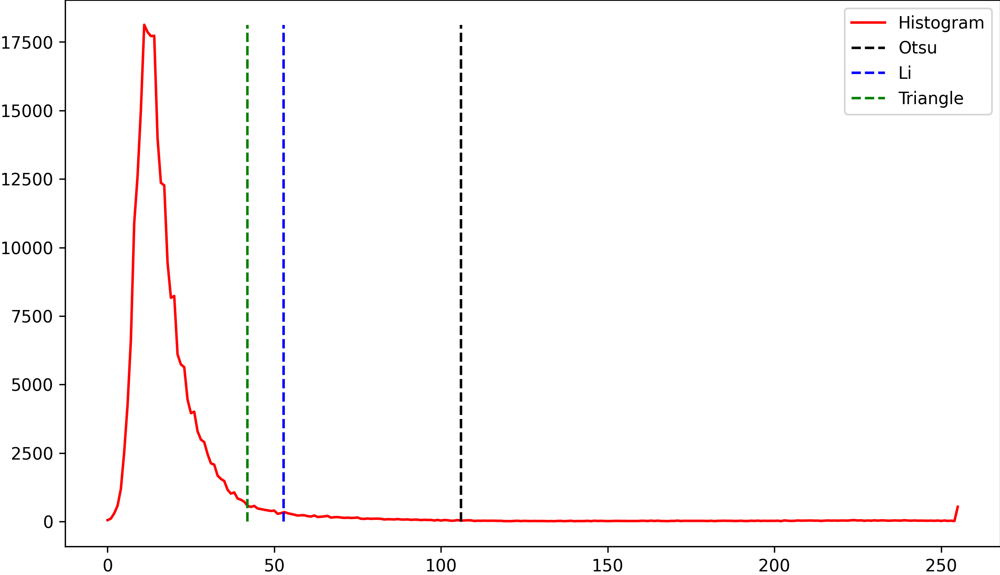


The black and white segmentation masks can then be obtained by simple relational expressions:

```python
bw_ot = img > th_ot
bw_li = img > th_li
bw_tr = img > th_tr
```

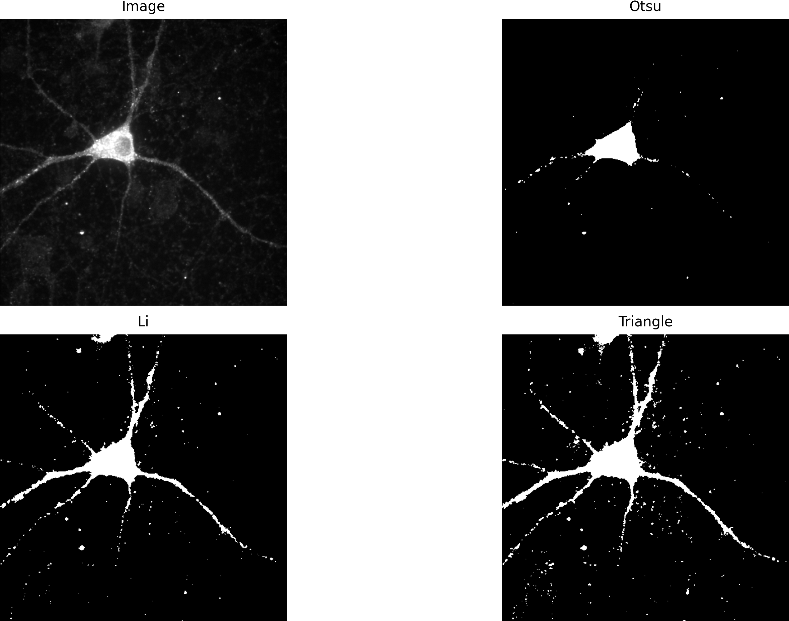

If the intensity of the objects tends to vary a lot, the Otsu algorithm might perform sub-optimally. Compare the Otsu segmentation with the one obtained by the Li or the Triangle algorithms. These algorithms are particularly robust to segmenting objects with a wide range of intensities.

## Background subtraction

Sometimes, segmentation based on simple thresholding fails spectacularly. For example, in the image below, the Otsu algorithm is applied to segment the individual cells that cover the whole field of view. Unfortunately, the Otsu-based segmentation fuses the whole center of the image into one gigantic blob. 

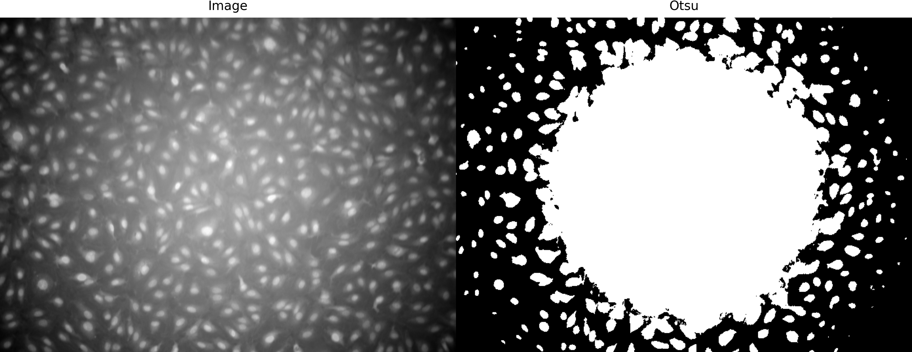

Often, cameras that cover large fields of view in microscopy acquisitions display a more intense average signal in the center of the view that slightly fades toward the borders. This *shading* effect can make object segmentation more difficult because no single threshold value will be optimal throughout the image. 

To investigate the reason for the failure of the Otsu algorithm on this image, we plot an intensity profile across the image. The plot shows that even though single cells are recognizable as sharp peaks across the profile, they lie on a highly curved background. The Otsu threshold cuts the hill across the middle, resulting in the whole image's central region being classified as foreground. Only a few cells at the periphery of the image are bright enough to be at least partially above the Otsu threshold.

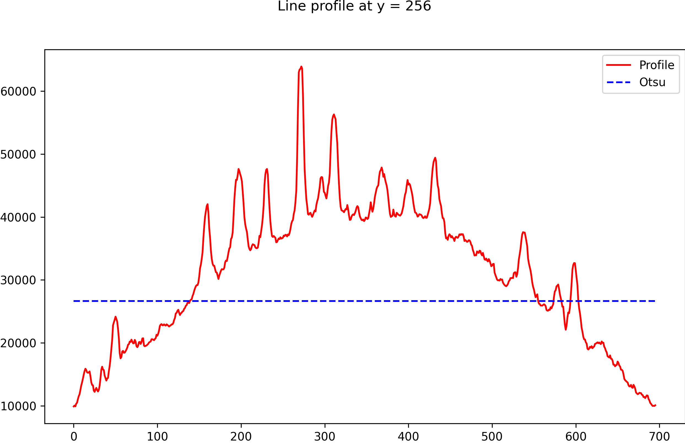

Our quick investigation shows a strong shading effect that significantly distorts the background level of the image. This effect can be corrected (or at least reduced) in several ways. The best method is to acquire a second image at the microscope containing only the background pixel intensities (that is, after removing the sample) and subtract this dark image from the image to be corrected. If this background image is not available, an approximation of the background can be estimated from the image itself. For this to work reliably, the signal must be ideally concentrated in small blobs surrounded by large background areas.

There are several algorithm that can be used to estimate the background of an image. The `iaf` library implements three distinct algorithms in the [`subtract_background()`](https://ia-res.ethz.ch/docs/iaf/process/index.html#iaf.process.subtract_background) function from the `iaf.process` package: `"rolling ball"`, `"morphological_opening"`, and `"gaussian"`[^subtract_background_algorithms]. While the morphological opening algorithm may be the most accurate, it is computationally expensive, and the rolling ball algorithm is the default for the function. To speed up computation at the expense of some potential reduction in the accuracy, the `subtract_background()` function provides an additional parameter `down_size_factor` that will scale down the image for processing. The value of `radius` is scaled accordingly. The end result of will be returned at the original image size.

[^subtract_background_algorithms]: More information about the actual algorithms can be found in the `iaf` documentation: [https://ia-res.ethz.ch/docs/iaf/process/index.html#iaf.process.subtract_background](https://ia-res.ethz.ch/docs/iaf/process/index.html#iaf.process.subtract_background).

We can run background subtraction as follows.

```python
img_corr, bkg = subtract_background(
    img, algorithm="morphological_opening",
    radius=25, return_background=True)
```

The `radius` parameter should be larger than the size of the objects in the image so that most pixels in the sampled neighborhood belong to the background. At the same time, the radius cannot be too large, or it will fail to estimate the *local* background.

We can use the [`plot_background_subtraction_control()`](https://ia-res.ethz.ch/docs/iaf/plot/validation/index.html) function from the `iaf.plot.validation` package to check the result.

```python
plot_background_subtraction_control(img, bkg)
```

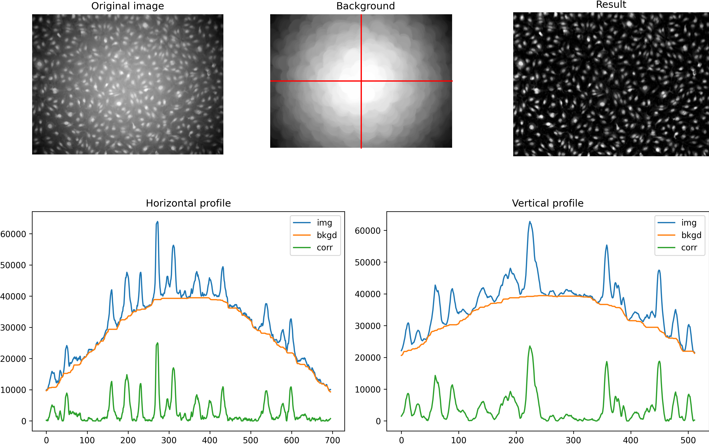

The function shows the original image, the estimated background, and the corrected image. One horizontal and one vertical profile across the center are plotted for all images. The blue `img` line shows the original image intensity, the orange `bkgd` line is the local background estimation, and the green `corr` line is the background-corrected intensity. The baseline of the corrected background should be as close to $0$ as possible for a good result. If it is not, lower or higher values of `radius` should be tested.
After background correction, the Otsu segmentation of the image works much better.

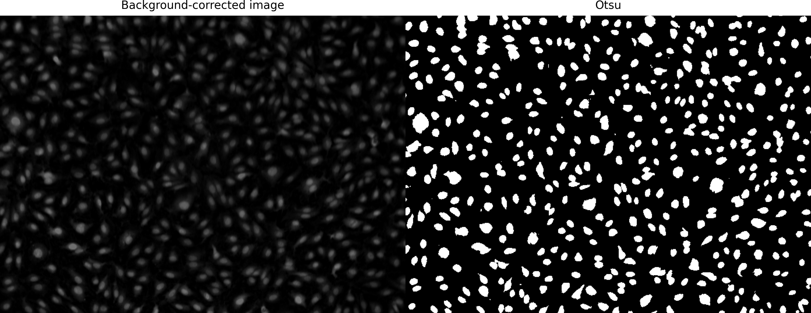

Please notice that background subtraction is not only crucial for correcting images with strong background shading. Another important application is the **ratiometric analysis** of two fluorescence channels. The ratio of the fluorescence channels could be used as a proxy for the relative concentration of two labeled proteins in the cell. However, the ratio of the signal intensities could be strongly affected if the image contains a significant background level. If the background signal is a significant fraction of the local intensity, it may dominate the calculation, and the ratio of the signals may become the ratio of the backgrounds!

## Connected components

The result of segmentation is usually a binary image with all pixels belonging to the background having value $0$ and those belonging to the foreground having value $1$. Human visual perception can easily recognize distinct objects in a binary image. However, the same binary image for the computer is just a large matrix of numbers; some entries are 0, while others are 1.

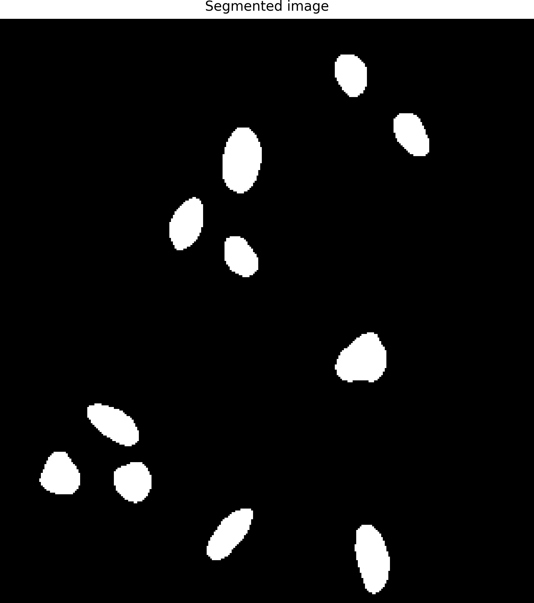

For the computer to make head or tail of it, we need to transform the binary mask into separate sets of foreground pixels to which we assign individual **labels**. These labels are unique integers starting from $1$; the background pixels are, by convention, assigned to the set with label $0$. 

The algorithm that implements this operation is called **connected component analysis** (or connected component **labeling**). The algorithm scans the binary image, groups all physically connected foreground pixels, and assigns them to the same connected component. Each connected component is separated from the others by intervening background pixels. In the resulting label image, all pixels inside each connected component are set to the same integer value.

Connected components now map to individual objects that are spatially separate from each other and for which we can extract features for further analysis. 

We can use the [`label()`](https://scikit-image.org/docs/dev/api/skimage.measure.html#skimage.measure.label) function from the `skimage.measure` package to perform connected component analysis (later we will see how to extract measurements):

```python
from skimage.measure import label

labels, num = label(bw, background=0, return_num=True, connectivity=1)
```

To visualize the labels we can use the [`show_labels()`](https://ia-res.ethz.ch/docs/iaf/plot/index.html#iaf.plot.show_labels) function from `iaf.plot`.

```python
from iaf.plot import show_labels

show_labels(labels, plot_labels=True, title="Connected components")
```

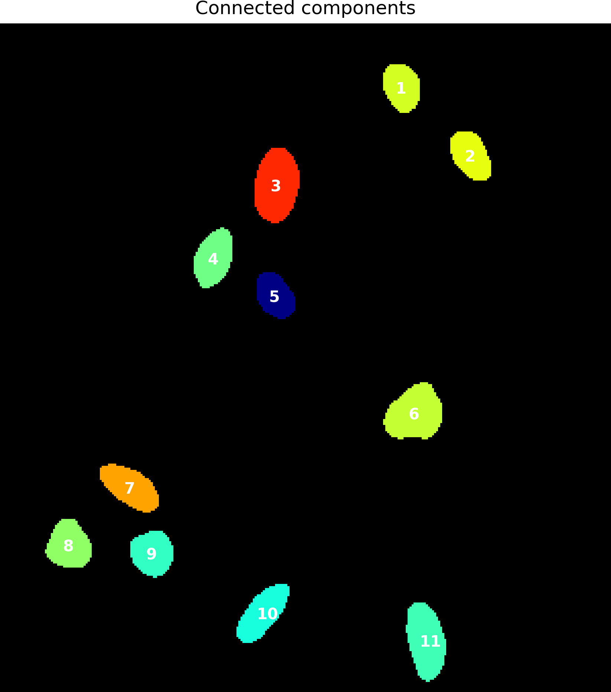


The `show_label()` function assigns different colors to the different objects. The `plot_labels=True` argument instructs `show_labels()` to display the component labels on top of each object. In addition, it can plot the center-of-mass location (see example below).

## Watershed segmentation

Sometimes, even if the segmentation works mostly fine, we still find that some of the objects are fused.

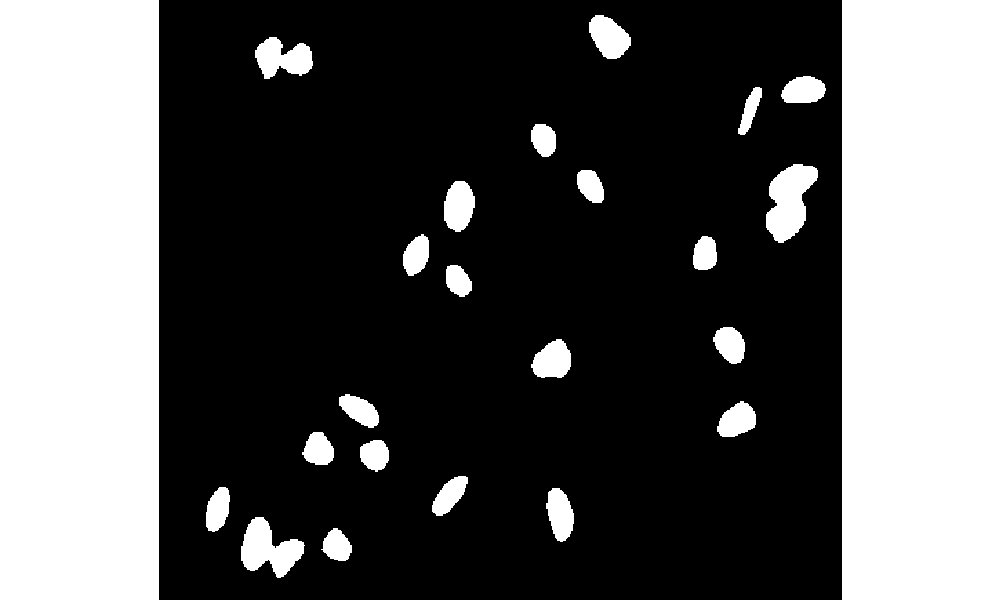

```python
labels, num = label(bw, background=0, return_num=True, connectivity=1)
print(f"Found {num} objects.")
```

```
Found 22 objects.
```

In the result of the connected component analysis, we see that some objects share the same label and therefore the same color, as shown in the figure below (yellow, red and blue objects). They also share one center of mass that is clearly between the two segments.

```python
show_labels(labels, plot_centroids=True)
```

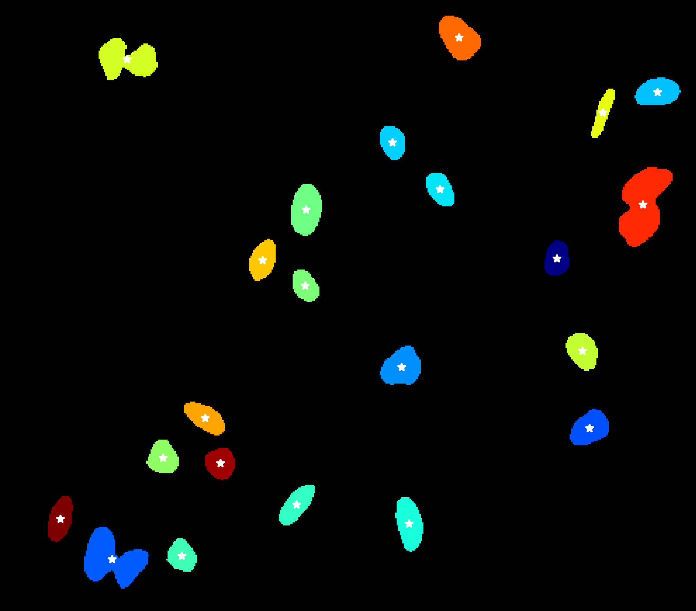

The watershed transform can help us separate the fused objects. In practice, we can use the [`separate_neighboring_objects()`](https://ia-res.ethz.ch/docs/iaf/morph/watershed/index.html#iaf.morph.watershed.separate_neighboring_objects) from the `iaf.morph.watershed` package[^watershed_cellprofiler].

[^watershed_cellprofiler]: The `separate_neighboring_objects` method is extracted, simplified and adapted from [CellProfiler](https://cellprofiler.org/)'s `IdentifyPrimaryObjects` module ([https://github.com/CellProfiler/CellProfiler/blob/master/cellprofiler/modules/identifyprimaryobjects.py](https://github.com/CellProfiler/CellProfiler/blob/master/cellprofiler/modules/identifyprimaryobjects.py)).

The [`estimate_object_sizes()`](https://ia-res.ethz.ch/docs/iaf/morph/watershed/index.html#iaf.morph.watershed.estimate_object_sizes) function from `iaf.morph.watershed` can help us set some of the arguments of `separate_neighboring_objects`[^min_size]:

[^min_size]: As a starting point, the `min_axis` value returned by `estimate_object_sizes()`  is a reasonable value for the `min_size` argument of `separate_neighboring_objects`.  Since `min_axis` is the median of all min axes, though, it often helps to reduce it a bit, *e.g.*, `...min_size = 0.8 * min_axis)`.

```python
area, min_axis, max_axis, equiv_diam = estimate_object_sizes(labels)

labels_sep, num_sep, _ = separate_neighboring_objects(bw, labels, min_size=min_axis)
print(f"Found {num_sep} objects.")
```

```
Found 25 objects.
```

We can check that the fused objects have now all been separated successfully.

```python
show_labels(labels_sep, plot_centroids=True)
```


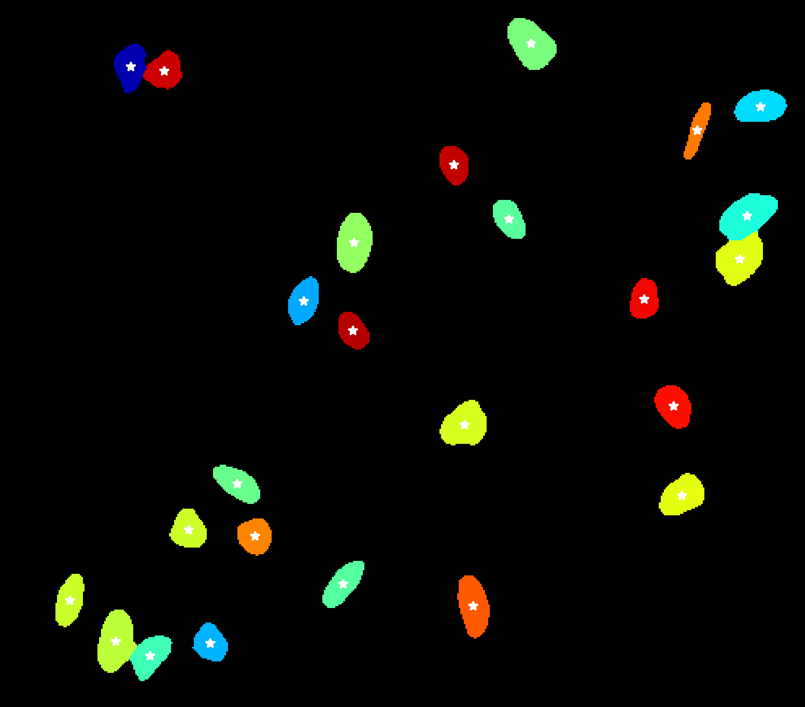


The `separate_neighboring_objects` function takes many arguments (please consult the [documentation](https://ia-res.ethz.ch/docs/iaf/morph/watershed/index.html#iaf.morph.watershed.separate_neighboring_objects)), but should have reasonable defaults. The `min_size` and `maxima_suppression_size` are probably the most sensitive ones.

## Morphological operations

Another problem of bad segmentation is the fragmentation of objects into smaller components. In the example below, a large fraction of the cytoplasm of the cell has very low signal, and a naïve thresholding assigns most of it to the image background.


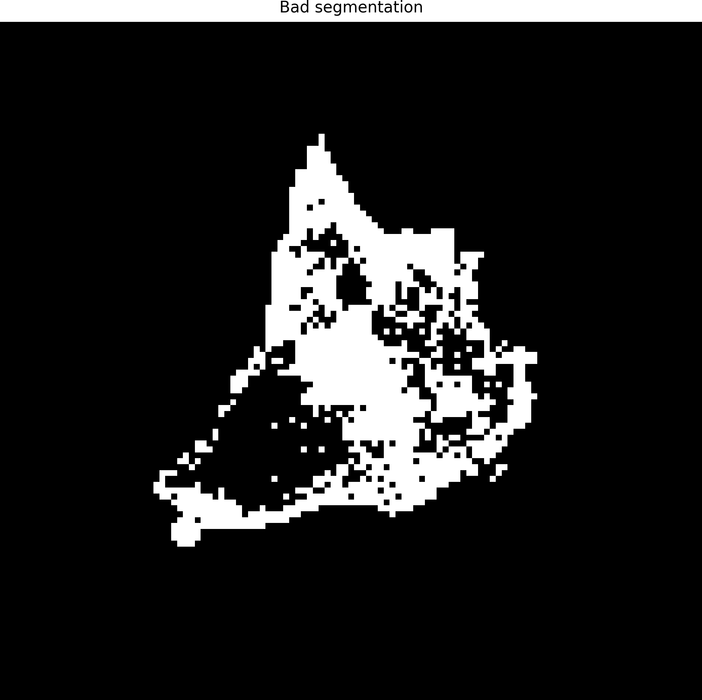

The subsequent connected component analysis will then create a large number of separate objects and their respective labels.

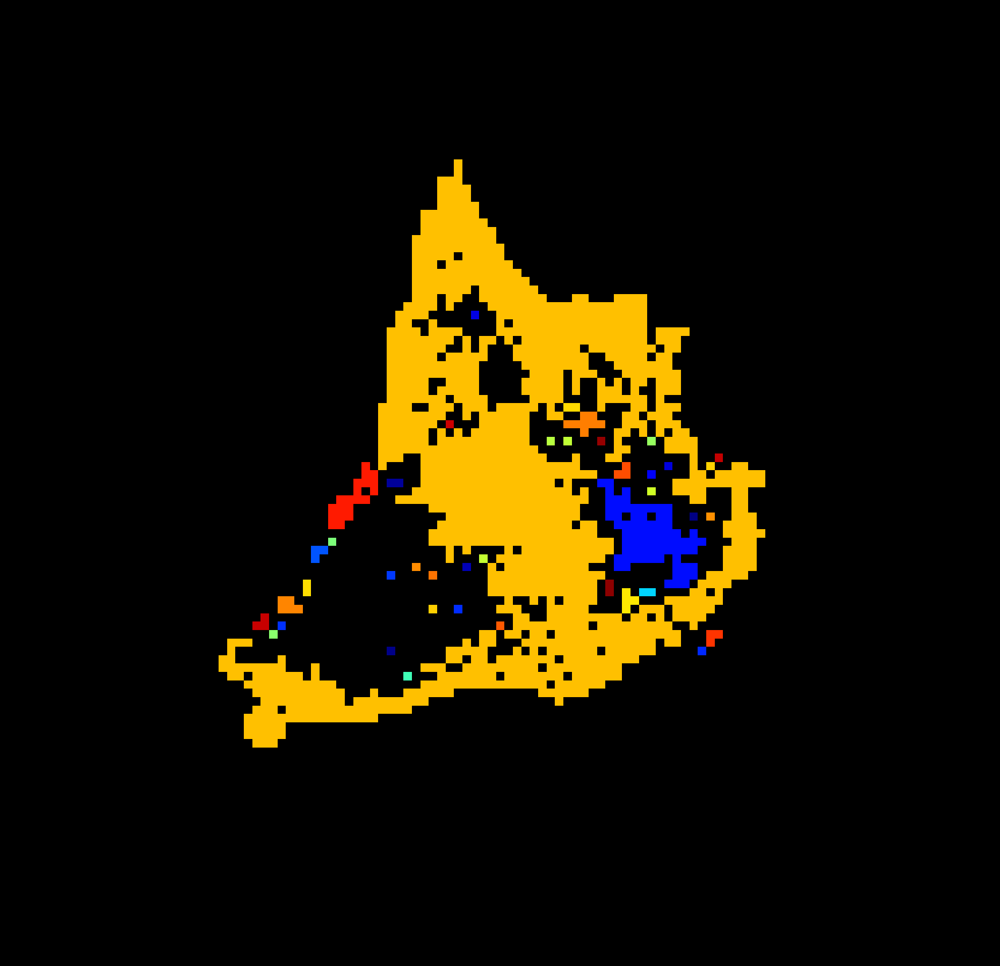

Morphological operations may help fixing this kind of problems[^issues_of_morphology]. If we run a round of [dilation()](https://scikit-image.org/docs/dev/api/skimage.morphology.html#skimage.morphology.dilation) (with a `disk` of radius $1$ as structuring element), we can increase the size of small fragments enough to have them merge with their immediate neighbors.

```python
from skimage.morphology import dilation, disk

dilated = dilation(bw, disk(1))
```

[^issues_of_morphology]: Care however must be taken not to incur into the previous problem, where separate objects get erroneously fused.

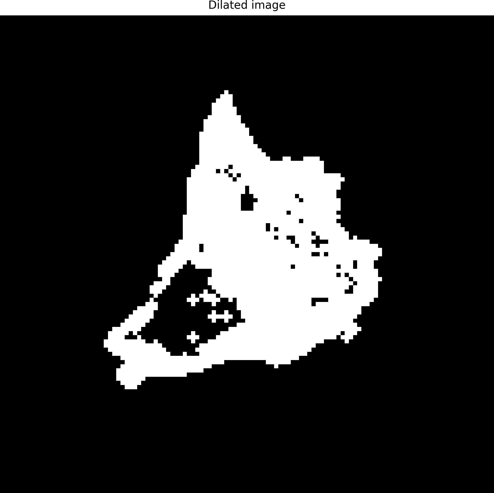

Then, we can run the morphological [`binary_fill_holes()`](https://docs.scipy.org/doc/scipy/reference/generated/scipy.ndimage.binary_fill_holes.html) operation (from `scipy.ndimage`) to turn all background pixels that are completely surrounded by foreground to foreground pixels:

```python
from scipy.ndimage import binary_fill_holes

filled = binary_fill_holes(dilated)
```

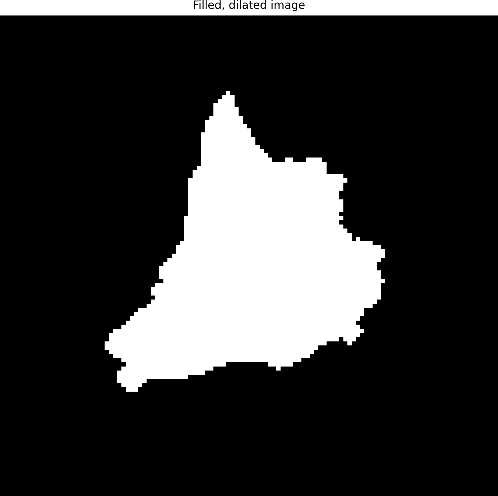

Finally, we can reverse the *fattening* effect of the original dilation with an [`erosion()`](https://scikit-image.org/docs/dev/api/skimage.morphology.html#skimage.morphology.binary_erosion) step with the same structuring element.

```python
eroded = erosion(filled, disk(1))
```

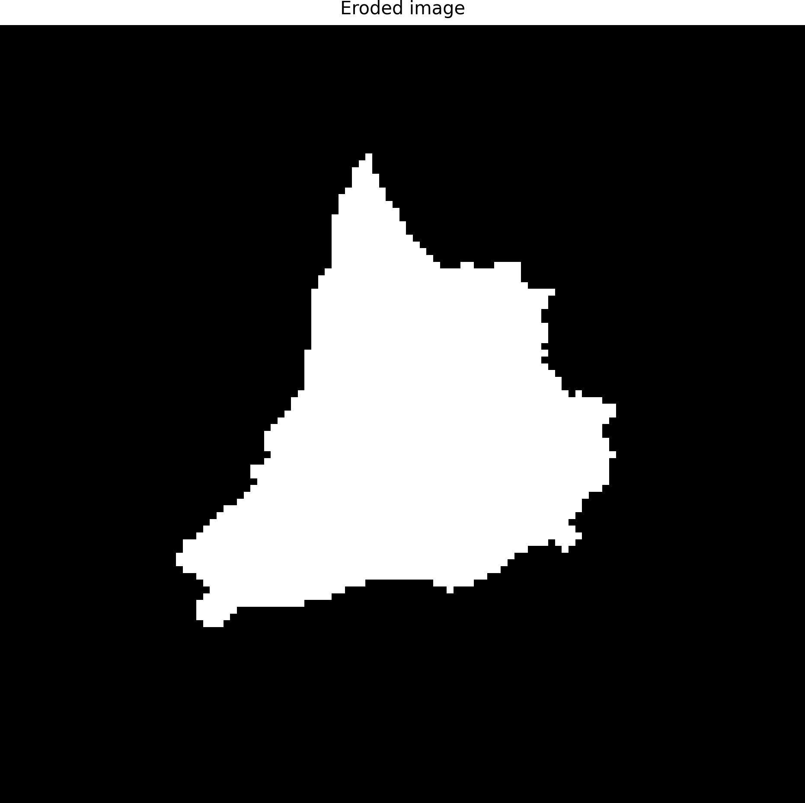

The erosion cannot carve holes into a homogeneous foreground field and we now have the complete object that the initial thresholding algorithm failed to segment.

## Measurements

The last step in our analysis workflow is the extraction of quantitative measurements from the segmented and post-processed objects. 

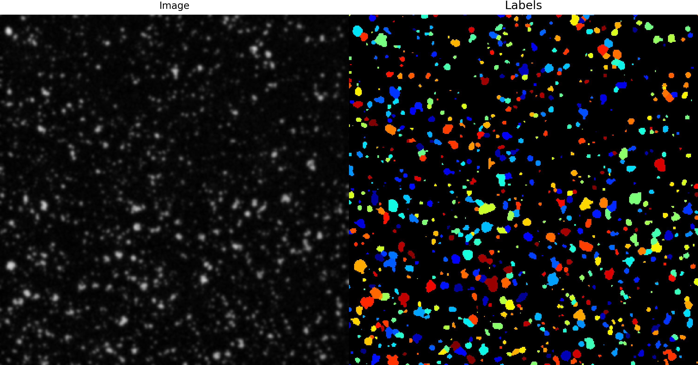


For this, we can use the [`regionprops()`](https://scikit-image.org/docs/dev/api/skimage.measure.html?highlight=regionprops#skimage.measure.regionprops) function (or its sibling [`regionprops_table()`](https://scikit-image.org/docs/dev/api/skimage.measure.html?highlight=regionprops#skimage.measure.regionprops_table)) from `skimage.measure`. In the figure above and in the following, `img` is an intensity (gray-value) image and `labels` is the result of connected component analysis.

```python
from skimage.measure import regionprops, regionprops_table

props = regionprops(labels, intensity_image=img)
```

The results of `regionprops()` is a long list of measurements for each of the labels, such as `area`, `centroid`, `eccentricity`, `intensity_mean`, `perimeter`, `solidity`, ... (for the complete list of features, please see the documentation of  [`regionprops()`](https://scikit-image.org/docs/dev/api/skimage.measure.html?highlight=regionprops#skimage.measure.regionprops)). Intensity-based measurements (such as `intensity_mean`) are only performed if a second argument `intensity_image` is passed to `regionprops`; if no intensity image is passed, only measurements that can be extracted from the labels (such as `area ` and `perimeter`) will be returned.

We can iterate over all meaurements as follows:

```python
for prop in props:
    print(f"label={prop.label:2}: area={prop.area:3}")
```

```
label= 1: area=  3
label= 2: area=  2
label= 3: area= 37
label= 4: area= 14
label= 5: area=  4
...
```

We can work with whole sets of measurements as follows:

```python
n, b = histogram(props["intensity_mean"])

plt.bar(b, n)
plt.suptitle("Intensity mean");
```

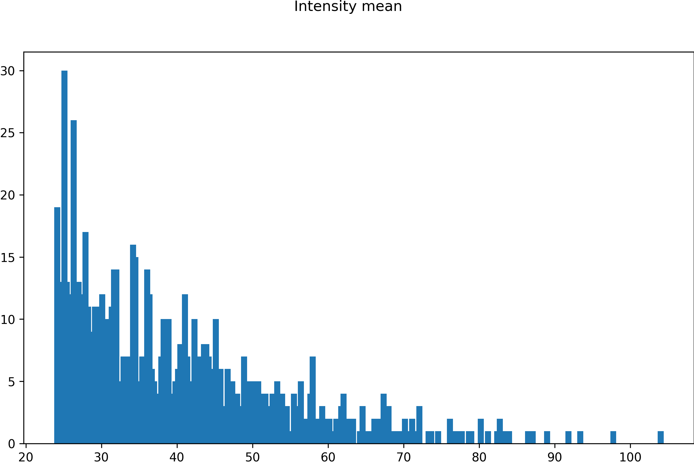

Additional measurements can be added to `regionprops()` by specifying functions that are passed to the `extra_properties` argument. Those functions will take a region mask as its first argument, and an optional intensity image as the second argument.

```python
def intensity_median(regionmask, intensity_image):
    return np.median(intensity_image[regionmask])

props = regionprops(labels, intensity_image=img, extra_properties=(intensity_median,))

props[0].intensity_median
```

```
35.0
```

