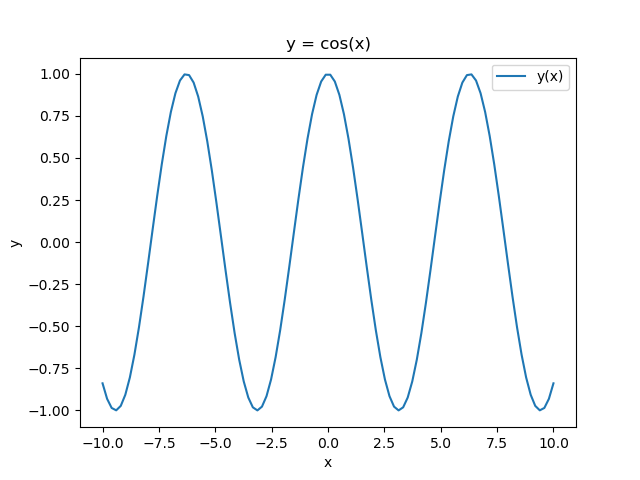
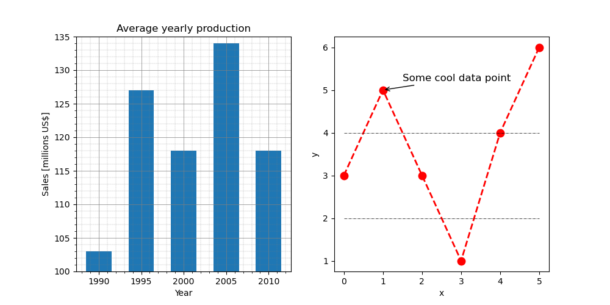

# Python Basics

This section introduces core Python syntax, data types, and control flow you'll use throughout the course.


## Hello World!

The first program in any programming language is always the **Hello, World!** program ([https://en.wikipedia.org/wiki/%22Hello,_World!%22_program](https://en.wikipedia.org/wiki/%22Hello,_World!%22_program)). It is a simple program that outputs the text `Hello, World!` on the screen[^run_from_file]:

[^run_from_file]: You can also type `print("Hello, World!")` into your text editor of choice, save it as `hello_world.py`, and run it from your Anaconda Prompt or terminal with `python hello_world.py`. This is anyway how you would run larger applications. **Careful**: please make sure to use an editor that saves as **plain text** (Visual Studio Code, Notepad, Notepad++, vim, ...): applications like TextEdit, Wordpad, or Microsoft Word, that save in a Rich Text format, will create files that the Python interpreter cannot understand. 

```python
In [1]: print("Hello, World!")
Hello, World!
```

## Python as a calculator

The Python interpreter directly executes **expressions** typed at the prompt, and can therefore be used as a simple calculator.

```python
In [1]: 2+2
```

```
Out[1]: 4
```

The basic arithmetic operators are `+`, `-`, `*`, `/`, `**`, `%` and these are used in conjunction with brackets: `()`. The symbol `**` is used to get exponents (powers): `2**4=16`. The symbol `%` is the modulo operator. **Operator precedence** in Python follows standard arithmetic order and is defined as follows:

1. quantities in brackets
2. powers ($**$)
3. $*$, $/$ working left to right
4. $+$, $-$ working left to right

  For example, 

```python
In [2]: (2+3)*4/5**2
```

is performed in this sequence:

1. **`(2+3)`** = 5 $\rightarrow$ **5** * 4 / 5**2
2. **`5**2`** = 25 $\rightarrow$ 5 * 4 / **25**
3. **`5*4`** = 20 $\rightarrow$ **20** / 25

and the output is:

```
Out[2]: 0.8
```

## Assignments (to variables)

When performing calculations at the Python prompt, the results are displayed on the console. But what if we want to use that result in a subsequent calculation? Manually retyping the output isn't efficient, especially for more complex code development. The solution is to *capture* the output for future use. This can be efficiently achieved by assigning the result to a **variable**:

```python
In [1]: a = 3 - 2**4   # No output!
```

The result ($-13$) is *assigned* to the *variable* `a`. We can now use this variable for a subsequent operation:

```python
In [2]: a * 5
```

```
Out[2]: -65
```

The value of `a * 5` is output to the console. If we want to store this result as well, we need to use another variable:

```python
In [3]: b = a * 5   # Again, no ouput!
```

We can now look at what variables we have:

```python
In [4]: a
```

```
Out[4]: -13
```

```python
In [5]: b
```

```
Out[5]: -65
```

In IPython / Jupyer Lab / Notebook, we can use the **magic commands** `who`  and `whos` (or `%who` or `%whos`) to see what variables we have defined so far.

```python
In [6]: whos
```

```
Variable   Type    Data/Info
----------------------------
a          int     -13
b          int     -65
```

We will discuss the `Type` of variables next.

## Variable (or data) types

We say that Python is a *dynamically-typed* language, because even though **it is** *typed*, we (mostly) do not need to explicitly state the type of a variable, as long as Python can infer it. 

A (data) type determines:

* the possible **values** for that type (integers, floating points, strings, booleans, ...);
* the **operations** that can be done on values of that type (*e.g.*, arithmetic operations on numbers, concatenation for strings, ...);
* the way values of that type can be **stored** (32-bit vs. 64-bit floating points, ...).

Most programming languages also allow the programmer to define *additional* data types (or *classes*), usually by combining multiple elements of other types and defining the valid operations of the new data type. We will discuss them later in the course.

### Numbers

In C++ (and C, Java, C#, and many others *statically-typed* languages), the following code would not compile:

```c++
a = 3;
```

Depending on the compiler, the error message would be something like this:

```bash
variables.cpp:3:2: error: 'a' was not declared in this scope
    3 |  a = 3;
      |  ^
```

Indeed, `a = 3` is an **assignment**, and in statically-typed languages a variable can be assigned a value only **after** it has been **declared**. 

```c++
int a;     # Declare a variable of type int(eger)
a = 3;     # Assign 3 to it
    
int b = 5; # This combines the two steps
```

In Python, this is legitimate:

```python
In [1]: a = 3
```

The Python interpreter infers that `3` is an integer number, and creates a variable `a` that is of type `int`. We can test this a follows:

```python
In [2]: type(a)
```

``` 
Out[2]: int
```

Integers are not the only type of numbers known to Python. **Floating point numbers** are **numbers** that contain floating decimal points[^other_number_types]. For example, $5.5$, $-2.0$, $1e-3$:

```python
In [3]: b = 1.3    
In [4]: type(b)
```
```
Out[4]: float
```

[^other_number_types]: Python also knows other type of numbers, such as `Decimal` ([https://docs.python.org/3/library/decimal.html#decimal.Decimal](https://docs.python.org/3/library/decimal.html#decimal.Decimal)), `Fraction` ([https://docs.python.org/3/library/fractions.html#fractions.Fraction](https://docs.python.org/3/library/fractions.html#fractions.Fraction), and `complex` ([https://docs.python.org/3/library/stdtypes.html#typesnumeric](https://docs.python.org/3/library/stdtypes.html#typesnumeric)) that we won't further discuss here.

The division operator `/` has an alternative version `//` that forces the result of the division to be an integer (for partial back-compatibility with Python 2):

```python
In [5]: 16 / 3
```

```
Out[5]: 5.333333333333333
```

```python
In [6]: 16 // 3
```

```
Out[6]: 5
```

### Strings

**Strings** represents sequences of characters (*i.e.*, text). A string can be defined in using single quotes `'...'` or double quotes `"..."`, and can even be mixed:

```python
In [1]: 'Do you like Python?'  # Single quotes
```

```
Out[1]: 'Do you like Python?'
```

```python
In [2]: "Of course!"  # Double quotes
```

```
Out[1]: 'Of course!'
```

```python
In [3]: "It's the best"  # Using double quotes, we can have single quotes in the string!
```

```
Out[3]: "It's the best"
```

```python
In [4]: 'It\'s the best'  # We can also 'escape' the single quote
```

```
Out[4]: "It's the best"
```

Strings can be **concatenated** with the `+` operator:

```python
In [5]: "Hello, " + "World!"
```

```
Out[5]: 'Hello, World!'
```

To concatenate strings and numbers, the number must be explicitly converted to string first:

```python
In [6]: "I am " + str(27) + " years old!"
```

```
Out[6]: 'I am 27 years old!'
```

In recent versions of Python, **f-strings** were introduced to simplify and optimize this concatenations:

```python
In [7]: age = 27
In [8]: f"I am {age} years old!"   # Notice the leading 'f'
```

```
Out[8]: 'I am 27 years old!'
```

**String literals** can span multiple lines and they are delimited by `"""..."""` or `'''...'''`. We will see examples of string literals when we discuss functions and their documentation.

### Lists

**Lists** are one of Python's *compound* data types, that are used to group values together. A list is a sequence of comma-separated values (or items) between square brackets. These items may be of different type, though in practice this is rarely the case.

```python
In [1]: squares = [1, 4, 9, 16, 25]
```

Lists (as all other **sequence** type, such as strings and tuples) can be **indexed** and **sliced**.

A list is **indexed** by passing an integer that represents the position of the value inside the list, with the first element of a list of `n` elements having `index = 0` and the last element having index `n - 1`. A list can also be indexed from the end, with the last index being `-1`.

```python
In [2]: squares[0]
```

```
Out[2]: 1
```

```python
In [3]: squares[4]
```

```
Out[3]: 25
```

```python
In [4]: squares[-1]
```

```
Out[4]: 25
```

A list is sliced by defining a **start** and an **end index** and optionally a **step**. Be aware that the start index is included, but the end index is excluded!

```python
In [5]: squares[1:3]   # Elements at indices 1 and 2
```

```
Out[5]: [4, 9]
```

```python
In [6]: squares[1:5:2] # 1 to 5 (excluded) with a step of 2
```

```
Out[67]: [4, 16]
```

If indices are omitted, they will fall back to their default values: `start = 0`, `stop = n`, `step = 1`.

```python
In [7]: squares[::2]  # From 0 to 4 (included) with step 2
```

```
Out[7]: [1, 9, 25]
```

Lists can be modifies in several ways. Individual and slices of numbers can be replaced:

```python
In [8]: squares[1] = 10             # -> [1, 10, 9, 16, 25]
In [9]: squares[2:5] = [50, 60, 70] # -> [1, 10, 50, 60, 70]
```

New numbers can be added to the list. The `append(element)` method adds the new element at the end of the list; the `insert(position, element)` adds the new element at the specified  position.

```python
In [10]: squares.append(100)   # -> [1, 10, 50, 60, 70, 100]
In [11]: squares.insert(0, -1) # -> [-1, 1, 10, 50, 60, 70, 100]
In [12]: squares.insert(3, 25) # -> [-1, 1, 10, 25, 50, 60, 70, 100]
```

Lists can be concatenated with the $+$ operator:

```python
In [13]: a = [1, 2, 3]
In [14]: b = [4, 5, 6]
In [15]: a + b
```

```
Out[15]: [1, 2, 3, 4, 5, 6]
```

The built-in function `len()` returns the number of elements in the list.

```python
In [16]: len(squares)
```

```
Out[16]: 8
```

### Tuples

**Tuples** are similar to lists, but are delimited by round brackets `( ... )` instead of square brackets. A tuple is an ordered and **unchangeable** collection of items. Once a tuple is defined, it cannot be changed anymore.

```python
In [1]: fruits = ("apple", "pear", "orange", "banana")
In [2]: len(fruits)
```

```
Out[2]: 4
```

```python
In [3]: fruits[2]
```

```
Out[3]: 'orange'
```

```python
In [4]: fruits[2] = "grapes"
```

```
TypeError: 'tuple' object does not support item assignment
```

One common usage of tuples is for **functions** (see below) to return more than one output.

### Dictionaries

**Dictionaries** are used to store data values in `key:value` pairs. A dictionary is an ordered[^ordered_dictionaries] collection of items (of any data type), that can be changed but that does not allow duplicates.

[^ordered_dictionaries]: Python dictionaries are ordered since Python 3.7. In earlier versions, the order was not preserved.

```python
[1]: car = {
    ...:     "brand": "Ford",
    ...:     "model": "Mustang",
    ...:     "year": 1964
    ...: }
    ...:              # Hit the enter key one more time to execute!    
In [2]: print(car)
```

```
{'brand': 'Ford', 'model': 'Mustang', 'year': 1964}
```

```python
In [3]: car["year"] = 1967
In [4]: car["year"]
```

```
Out[4]: 1967
```

New keys can be added at any time:

```python
In [5]: car["color"] = "red"
In [6]: car
```

```
Out[6]: {'brand': 'Ford', 'model': 'Mustang', 'year': 1964, 'color': 'red'}
```

`key:value` pairs can be removed from the dictionary with the `del` command.

```python
In [7]: del car["brand"]
In [8]: car
```

```
Out[8]: {'model': 'Mustang', 'year': 1964, 'color': 'red'}
```

Keys and values can be queried with the `keys()` and `values()` methods, respectively. Later, we will see how to use these (and the `items()` method) to iterate over a dictionary:

```python
In [9]: print(car.keys())
```

```
dict_keys(['model', 'year', 'color'])
```

```python
In [10]: print(car.values())
```

```
dict_values(['Mustang', 1964, 'red'])
```

```python
In [11]: print(car.items())
```

```
dict_items([('model', 'Mustang'), ('year', 1964), ('color', 'red')])
```

## Code indentation

Before moving on to more complex topics that require *combinations of statements*, we need to discuss a fundamental distinction between Python and most other programming languages. In Python, code formatting is not merely aesthetic, but it dictates the code's structure itself! Consider this short C++ (sub)program:

```c++
for (int i=0; i<10; i++)
{
    if (i == 5)
    {
        break;
    }
}
```

Here, a **block** of code is encapsulated by curly braces `{ ... }`. This code is completely equivalent to:

```c++
for(int i=0; i<10; i++){if(i == 5) {break;}}
```

Contrast this with the equivalent Python code:

```python
for i in range(10):
    if i == 5:
        break
```

In Python, **blocks** are determined by the level of **indentation**! Lines indented by an equal number of spaces are part of the same block! Any deviation in formatting could disrupt the code's functionality. While this makes Python's code very clean, we have to be especially careful: altering the formatting could yield unpredictable (wrong!) behavior.

The two code snippets below have only one difference: the indentation of the `delete_dir(dirname)` line. Which of the two snippets behave as intuitively expected (**A** or **B**)? What does the other one do?

**Notice: for your safety (and the safety of your data), the `delete_dir()` function does not exist.**

```python
# A
r = input(f"Delete directory '{dirname}' ?")
if r == "y":
    print(f"Deleting directory '{dirname}'...")
    delete_dir(dirname)

# B
r = input(f"Delete directory '{dirname}' ?")
if r == "y":
    print(f"Deleting directory '{dirname}'...")
delete_dir(dirname)
```

## Relational and logical operators

A **relational operator** is a language construct or operator that tests or defines some kind of relation between two entities. These include numerical equality (*e.g.*, `5 == 5`) and inequality (*e.g.*, `4 >= 3`): the result of such a test is either `True` or `False` [^booleans]. 

[^booleans]: Please mind the case: **True** (not: **true**);  **False** (not: **false**).

An expression created using a relational operator forms what is known as a **relational expression** or a **condition**. In Python, relational operators are `==` (*equal to*), `!=` (*not equal to*), `<` (*less than*), `>` (*greater than*), `<=` (l*ess than or equal to*), `>=` (*greater than or equal to*).

```python
In [1]: a = 5
In [2]: a > 3
```

```
Out[2]: True
```

The result of a relational expression is a variable of type `bool` (**boolean**) and its value can be either `True` or `False` (and nothing else). 

A **logical operator** combines relational expressions in a way that again results in either a `True` or `False` result. Here we will consider the `and`, `or` and `not` operators, that operate on *scalars*.

```python
In [3]: a > 3 and a % 2 == 0
```

```
Out[3]: False
```

While `a` (*i.e.*, `5`) is indeed larger than `3`, it is not an even number and therefore the combined expression:

```python
In [4]: a > 3 and a % 2 == 0
```

evaluates to `False`. The `and` and `or` operators are so-called **short-circuit operators**: they evaluate their second operand only when the result is not fully determined by the first operand. Short-circuit operators are handy in situations like the following:

```python
In [5]: b = 0
In [6]: b != 0 and a / b > 0
```

```
Out[6]: False
```

If `b` is 0, `a / b` (*i.e.*, `a / 0`) is never calculated[^divideByZero].

[^divideByZero]: Without the short-circuiting of the first check, `a/b` would be evaluated and would result in a `ZeroDivisionError: division by zero`.

A logical expression

```python
A and B and C and ... and Z
```

is true only if **all** statements `A`, `B`, `C`, ..., `Z` are true[^logicalConjunction].

[^logicalConjunction]: See the section on *logical conjunction* on [http://en.wikipedia.org/wiki/Truth_table](http://en.wikipedia.org/wiki/Truth_table).

A logical expression

```python
A or B or C or ... or Z
```

is true if **at least one** of its operands is true[^logicalDisjunction].

[^logicalDisjunction]: See the section on *logical disjunction* on [http://en.wikipedia.org/wiki/Truth_table](http://en.wikipedia.org/wiki/Truth_table).

The `not` operator, produces a value of `True` if its operand is `False` and a value of `False` if its operand is `True`[^logicalNegation].

[^logicalNegation]: See the section on *logical negation* on [http://en.wikipedia.org/wiki/Truth_table](http://en.wikipedia.org/wiki/Truth_table).

## Conditional flow control: if, else

**Conditional statements** enable selecting at run time which block of code to execute. The code path to run is chosen depending on the result of one or more logical operations. The simplest conditional statement is an `if` statement. For example:

```python
In [1]: from random import randint # We will discuss modules later
In [2]: a = randint(1, 100) # Random integer between 1 and 100
In [3]: if a % 2 == 0:
    ...:     print("a is even!")
```

If `a` is even, this code will output:

```
a is even!
```

Unfortunately, if `a` is odd nothing will be output. The keyword `else` comes to rescue:

```python
In [4]: if a % 2 == 0:
    ...:     print("a is even!")
    ...: else:
    ...:     print("a is odd!")
```

Now all cases are covered. `If` statements can include any number of alternate choices using the keyword `elif` (*else if*):

```python
In [5]: if a < 30:
    ...:     print("small")
    ...: elif a < 80:
    ...:     print("medium")
    ...: else:
    ...:     print("large")
```

Notice that `a = 20` would satisfy both the first and the second test, but Python exits the `if` block as soon as the first `True` condition is met.

## Loop control: for, while, continue, break

### `for` loop

A `for` loop is used for iterating over the items of any sequence (*e.g.*, a list, a tuple, a dictionary, a set, a string, or a range):

```python
for i in sequence:
    statements
```

For example:

```python
In [1]: fruits = ["apple", "banana", "cherry"]
In [2]: for f in fruits:
    ...:     print(f)
```

```
apple
banana
cherry
```

To iterate over a sequence of numbers, the `range()` function can be used:

```python
In [3]: for i in range(0, 5, 2): # From 0 (included) to 5 (excluded) with step 2
    ...:     print(i)
```

```
0
2
4
```

`for` loops can be nested:

```python
In [4]: for x in range(1, 4):       # 1, 2, 3
    ...:     for y in range(1, 3):  # 1, 2
    ...:         print(x + y)
```

The two nested loops above result in the following sequence of operations:

```matlab
(x = 1) + (y = 1) = 2
(x = 1) + (y = 2) = 3
(x = 2) + (y = 1) = 3
(x = 2) + (y = 2) = 4
(x = 3) + (y = 1) = 4
(x = 3) + (y = 2) = 5
```

For each iteration of the external `for` loop, all iterations of the internal loop are executed. 

Dictionaries can be iterated over in a series of ways:

```python
In [5]: car = {
   ...:     "brand": "Ford",
   ...:     "model": "Mustang",
   ...:     "year": 1964
   ...: }
In [6]: for key in car:                # Iterates over the keys
    ...:     print(key)
```

```
brand
model
year
```

```python
In [7]: for key in car.keys():         # Again, iterates over the keys
    ...:     print(key)
```

```
brand
model
year
```

```python
In [8]: for value in car.values():     # Iterates over the values
    ...:     print(value)
```

```
Ford
Mustang
1964
```

```python
In [9]: for key, value in car.items(): # Iterates over the items (tuple!)
    ...:     print(key, value)
```

```
brand Ford
model Mustang
year 1964
```

### `while` loop

The `while` loop repeats a group of statements an indefinite number of times under control of a logical condition. A `while` statement has following syntax:

```python
while expression:
    statements
```

As long as `expression` is `True`, the statements will be executed.

**Example** If we sum all integer numbers starting from `n = 1`, what is the first value of `n` for which the sum of all integers `1 + 2 + 3 + ... + n` exceeds 100? 

```python
In [1]: n = 0
    ...: sum = 0
    ...: while sum <= 100:   # As soon as this turns False, the block is
    ...:     n = n + 1       # no longer executed!
    ...:     sum = sum + n
    ...: print(n)
```

```
14
```

With `n = 13`, the sum is 91.  With `n = 14`, the sum is 105, and is larger than 100 for the first time: the `sum <= 100` expression returns `False` and  the `while` loop is exited.

### `continue` and `break`

The `continue` operator passes control to the next iteration of the `for` or `while` loop in which it appears, skipping any remaining statements in the body of the loop. The same holds true for `continue` statements in **nested** loops. That is, execution continues at the beginning of the loop in which the continue statement was encountered.

```python
In [1]: for x in range(6):
    ...:     if x == 3:
    ...:         continue
    ...:     print(x)
```

```
0
1
2
4
5
```

The `break` statement lets you exit early from a `for` loop or `while` loop. In nested loops, break exits from the innermost loop only. 

```python
In [2]: for x in range(6):
    ...:     if x == 3:
    ...:         break
    ...:     print(x)
```

```
0
1
2
```

## Functions

Functions are program routines that optionally accept input arguments, perform some computation, and optionally return output arguments. 

Let's define a simple function that returns the maximum of two numbers.

```python
In [1]: def max(a, b):
    ...:     """Returns the max of two numbers."""
    ...:     if a >= b:
    ...:         return a
    ...:     else:
    ...:         return b
```

The **function definition** is introduced by the keyword `def`, followed by the name of the function (`max`) and an optional list of input arguments (here `a` and `b`). Parentheses are mandatory, even if there are no input arguments. All the statements that belong to the function must be indented. The first statement of the function body can optionally be a **string literal** (delimited by `""" ... """`; this string literal is the function's documentation string, or *docstring* [^docstring_conventions]. 

[^docstring_conventions]: There are several conventions and standards on how doctrings should be formatted. See for example: [https://www.python.org/dev/peps/pep-0257/](https://www.python.org/dev/peps/pep-0257/).

A function can return one or more output arguments using the keyword `return`.

```python
In [2]: c = max(5, 7)
In [3]: c
```

```
Out[3]: 7
```

### Types of function arguments

In Python, the arguments of a function can be divided into several categories: **required**, **positional**, **optional with default values**, and **keyword arguments**. The slightly confusing aspect of this argument classification is that the type of an argument is determined not only by its definition in the function signature, but (mostly) by how it is used in the function call[^special_parameters].

[^special_parameters]: There is even more flexibility in how parameters can be handled, but we do not need to discuss it for our purposes. More information can be found here: [https://docs.python.org/3/tutorial/controlflow.html#special-parameters](https://docs.python.org/3/tutorial/controlflow.html#special-parameters).

For instance, consider the following `fun_with_args` function:

```python
In [4]: def fun_with_args(a, b=10, c=20):
    ...:     """Function to explain the possible argument types."""
    ...:     return a + b + c
```

#### Positional arguments

If the function `fun_with_args` is called without specifying the names of the arguments, the parameters are **positional**.

```python
In [5]: fun_with_args(1, 2, 3) # a=1, b=2, c=3 
```

All parameters are determined by their respective **positions** in the function call.

#### Keyword arguments

If we explicitly specify the argument **names**, the parameters become **keyword parameters**.

```python
In [6]: fun_with_args(a=1, b=2, c=3) # a=1, b=2, c=3 
```

#### Arguments with default values

We can omit arguments that have a **default values** assigned to them.

```python
In [7]: fun_with_args(1) # a=1, b=10 (default), c=20 (default) 
```

#### Mixed

Finally, we can combine everything.

```python
In [8]: fun_with_args(1, c=3) # a=1, b=10 (default), c=3
```

Here, `a` is a required argument filled positionally, `c` is a keyword argument, and `b` is left at its default value. Note that when using both positional and keyword arguments in a function call, all positional arguments must come before any keyword arguments.

```python
In [9]: fun_with_args(c=3, b=2, 1) # ERROR!
```

```
    fun_with_args(c=3, b=2, 1)
                             ^
SyntaxError: positional argument follows keyword argument
```

In the previous call, it is not clear to which parameter the value `1` should be assigned: since it is not explicitly named, it is expected to be filled positionally, but it is passed in the wrong place.

In summary, the classification of an argument as required, positional, having a default value, or being a keyword argument is largely determined by how the function is called, not solely by how its parameters are defined.

## Python modules and packages

Python offers **modules** and **packages** to break down large programs into manageable, reusable parts.

### Modules

In Python, a **module** serves as a container for code that can be reused across various programs. A module can be either built-in, part of Python's standard library, or user-defined, that is created by individual developers. Regardless of its origin, a module becomes accessible in your program through the `import` statement. For instance, we can import a `my_module` module as follows:

```python
import my_module
```

#### Module search path

When we import a module, Python looks for it in several locations:

- The directory where the script runs or the current directory in an interactive session (*e.g.*, Python or IPython).
- Directories listed in the `PYTHONPATH` environment variable.
- Installation-dependent directories or (conda) virtual environments.

#### Interacting with a module

Assuming we wrote a module named `my_module.py` with various definitions:

```python
# my_module.py
s = "This is a string from my_module."
a = [0, 1, 2, 3]

def my_fun(arg):
    print(arg)

class My_Class:
    def __init__(self, id=1):
        self.id = id
        print(self.id)
```

we can interact with it as follows:

```python
# IPython started from /home/aaron
In [1]: import my_module
In [2]: my_module
```

```
Out[2]: <module 'my_module' from '/home/username/my_module.py'>
```

```python
In [3]: my_module.s
```

```
Out[3]: 'This is a string from my_module.'
```

```python
In [4]: my_module.a
```

```
Out[4]: [0, 1, 2, 3]
```

```python
In [5]: my_module.my_fun(10)
```

```
Out[5]: 10
```

```python
In [6]: m = my_module.My_Class()   
```

```
Out[6]: 1
```

Notice how we prepend the module name to the objects that it contains. Indeed, the following call fails:

```python
In [7]: m = My_Class()
```

```
NameError: name 'My_Class' is not defined
```

#### Namespace isolation

When imported, the objects from a module reside in their own **namespace**, thus avoiding any naming conflicts. It is indeed a good (defensive) programming strategy to import modules and target their contents with the `module.attribute` syntax. However, it is possible to import objects directly into the caller's namespace as follows:

```python
In [8]: from my_module import my_fun, My_Class
In [9]: my_fun(12)
```

```
Out[9]: 12
```

#### Caution: overwriting namespace

Be cautious, as importing objects directly into the caller's namespace can overwrite existing objects.

```python
In [10]: s = "This is the variable s in the base namespace."
In [11]: s
```

```
Out[11]: 'This is the variable s in the base namespace.'
```

```python
In [12]: from my_module import s
In [13]: s
```

```
Out[13]: 'This is a string from my_module.' 
```

To import everything from a module, use:

```python
In [14]: from my_module import *
```

Use this with care. Some modules are quite extensive and will add a lot of names into the namespace (with the risk of *name collision*). Also, importing many unneeded objects will take time and use up memory unnecessarily.

#### Aliasing

It is also possible to import objects with alternate names (aliases):

```python
In [15]: from my_module import My_Class as MC
In [16]: import my_module as mmod
```

# Essential third-party libraries 

## NumPy

NumPy ([https://numpy.org](https://numpy.org)) adds support for high-performance multi-dimensional arrays to Python, along with a large collection of high-level mathematical functions to operate on these arrays. NumPy is open-source software and has many contributors. Almost all scientific libraries for Python use NumPy arrays as their back-end data structure, rendering them all fully compatible with each other. The QuickStart tutorial ([https://numpy.org/doc/stable/user/quickstart.html](https://numpy.org/doc/stable/user/quickstart.html)) gently introduces the fundamental aspects of NumPy. Here, we will look at some of those basics.

First of all, NumPy must be imported into Python. It is convention to import is with an alias, `np`.

```python
In [1]: import numpy as np
```

There are many ways to create NumPy[^numpy_array_api] arrays.

[^numpy_array_api]: See [https://numpy.org/doc/stable/reference/arrays.ndarray.html](https://numpy.org/doc/stable/reference/arrays.ndarray.html) for the full API.

```python
# From Python lists
In [2]: a = np.array([1, 2, 3, 4, 5, 6])  # 1D array
In [3]: a
```

```
Out[3]: array([1, 2, 3, 4, 5, 6])
```

```python
In [4]: b = np.array([[1, 2, 3], [4, 5, 6]])  # 2D array
In [5]: b
```

```
Out[5]: 
array([[1, 2, 3],
       [4, 5, 6]])
```

```python
# Specifying the final dimensions (shape), type and filling value
In [6]: c = np.zeros((3, 2, 4), dtype=np.float64)  # 3D array (z, y, x)
In [7]: c
```

```
Out[7]:
array([[[0., 0., 0., 0.],
        [0., 0., 0., 0.]],
       [[0., 0., 0., 0.],
        [0., 0., 0., 0.]],
       [[0., 0., 0., 0.],
        [0., 0., 0., 0.]]])
```

```python
In [8]: c = np.ones((1, 2), dtype=int) # 1 row, 2 columns
In [9]: c
```

```
Out[9]:
array([[1, 1]])
```

```python
# Using specific distributions
In [10]: n = np.random.randn(1000)  # Normal distribution N(0, 1)
```

NumPy arrays have many operations associated to them. For instance, we can calculate mean and standard deviation of the `n` array above like this:

```python
In [11]: n.mean()
```

```
Out[11]: -0.007093885346150171  # Close to the expected value 0.0
```

```python
In [12]: n.std()
```

```
Out[12]: 0.9869874098207414     # Close to the expected value 1.0 
```

Indexing and slicing NumPy arrays works as with standard Python arrays:

```python
In [13]: a = np.arange(5, 11)
In [14]: a
```

```
Out[14]: array([5, 6, 7, 8, 9, 10])
```

```python
In [15]: a[0]
```

```
Out[15]: 5
```

```python
In [16]: a[-1]    # Last element in the array
```

```
Out[16]: 10
```

```python
In [17]: a[::2]   # From beginning to end with step 2
```

```
Out[17]: array([5, 7, 9])
```

```python
In [18]: a[::-1]   # Cool way to reverse an array
```

```
Out[18]: array([10,  9,  8,  7,  6,  5])
```

Arithmetic operations on NumPy array are applied element-wise:

```python
In [19]: a = np.array([1, 2, 3])
In [20]: b = np.array([4, 5, 6])
In [21]: a * b
```

```
Out[21]: array([ 4, 10, 18])
```

Matrix multiplications are possible using the operator `@`. For a matrix multiplication we need `a` to be of shape `(3, 1)` and `b` to be `(1, 3)`: `a @ b` results in `3, 3` matrix (outer product). Alternatively, if `a` is `(1, 3)` and b is `(3, 1)`, the result is a scalar (`(1, 1)`) and  the operation reduces to the dot product of the two vectors.

```python
In [22]: a.reshape((3, 1)) @ b.reshape((1, 3))
```

```
Out[22]: 
array([[ 4,  5,  6],
       [ 8, 10, 12],
       [12, 15, 18]])
```

```python
In [23]: a.reshape((1, 3)) @ b.reshape((3, 1))
```

```
Out[23]: array([[32]])
```

Finding elements in arrays is possible using the `where()` function. Let's create a small 1D vector `a` to work with:

```python
In [24]: a = np.arange(11, 20)
In [25]: a
```

```
Out[25]: array([11, 12, 13, 14, 15, 16, 17, 18, 19])
```

Let's find the indices of the elements of `a` that satisfiy some simple condition:

```python
In [26]: indices, = np.where(a > 15)  # Returns a tuple x, y
In [27]: indices
```

```
Out[27]: array([5, 6, 7, 8])
```

```python
# Let's check
In [28]: a[indices]
```

```
Out[28]: array([16, 17, 18, 19]) # Indeed, all > 15!
```

Notice that `np.where` returns a tuple of indices for each dimension of the array. If the array is 1D, only one vector if indices is returned, but still packed in a tuple!

We can also combine logical expressions[^array_logic]:

[^array_logic]: Notice that the **vector** equivalents of `and` and `or` are `&` and `|`, respectively.

```python
In [29]: indices, = np.where((a > 13) & (a <= 15))
In [30]: indices
```

```
Out[30]: array([3, 4])
```

```python
# Let's check
In [31]: a[indices]
```

```
Out[31]: array([14, 15]) # Indeed, 13<a[indices]<=15!
```

`np.where` also works in 2D and beyond.

```python
In [32]: b = np.arange(1, 17).reshape(4, 4)
In [33]: b
```

```
Out[33]: 
array([[ 1,  2,  3,  4],
       [ 5,  6,  7,  8],
       [ 9, 10, 11, 12],
       [13, 14, 15, 16]])
```

```python
# Find some values
In [34]: indices = np.where((b > 12) & (b < 15))
In [35]: indices
```

```
Out[35]: (array([3, 3]), array([0, 1]))
```

```python
# The values that satisfy the conditions are (3, 0) and (3, 1)
In [36]: b[indices]
```

```
Out[36]: array([13, 14]) # Indeed, 12<b[indices]<15!
```

**Logical indexing** can also be used to select subsets of NumPy arrays:

```python
In [37]: a >= 16
```

```
Out[37]: array([False, False, False, False, False,  True,  True,  True,  True])
```

We can directly use a boolean array to select elements from another array. Implicitly, the values of the array at the indices that correspond to the indices of the `True` values in the boolean array are used:

```python
In [38]: a[a >= 16]
```

```
Out [38]: array([16, 17, 18, 19])
```

## Pandas

**pandas** ([https://pandas.pydata.org](https://pandas.pydata.org)) is a library for Python for data manipulation and analysis. In particular, it offers data structures and operations for manipulating numerical tables and time series.

First of all, pandas must be imported into Python. It is convention to import is with an alias, `pd`.

```python
In [1]: import pandas as pd
```

Important data structures in pandas are `DataFrame` and `Series`. A DataFrame consists of one or more Series.

```python
In [2]: s = pd.Series([1, 3, 5, np.nan, 6, 8])
In [3]: s
```

```
Out[3]:
0    1.0
1    3.0
2    5.0
3    NaN
4    6.0
5    8.0
dtype: float64
```

Every value in a Series has an **index** associated to it (the numbers 0 to 5 on the left of the Series values above). `NaN` indicates a missing value.

A DataFrame consists of one or more Series organized in **columns**, with an index associated to them (not necessarily numeric).

```python
In [4]: dates = pd.date_range("20210901", periods=6)
In [5]: dates
```

```
Out[5]:
DatetimeIndex(['2021-09-01', '2021-09-02', '2021-09-03', '2021-09-04',
               '2021-09-05', '2021-09-06'],
              dtype='datetime64[ns]', freq='D')
```

```python
In [6]: df = pd.DataFrame(np.random.randn(6, 4), index=dates, columns=["A", "B", "C", "D"])
In [7]: df
```

```
Out[7]:
                   A         B         C         D
2021-09-01 -1.896984 -0.784408 -0.176049  0.678751
2021-09-02  0.036235  0.934565 -0.929419  0.511440
2021-09-03  0.308496  1.357357  0.422399 -1.228895
2021-09-04 -0.978040  0.555728 -1.982682 -0.289128
2021-09-05 -0.599076  1.144799 -1.416163  0.469280
2021-09-06 -0.462621  2.194998  0.596607 -1.163095
```

Often, a DataFrame is imported into pandas from a text file, an Excel datasheet, a MySQL database, or an URL.

```python
In [8]: df = pd.read_csv("iris.csv", sep=",")
In [9]: df.columns
```

```
Out[9]:
Index(['sepal length (cm)', 'sepal width (cm)', 'petal length (cm)',
       'petal width (cm)', 'species'],
      dtype='object')
```

```python
In [10]: df.columns = ['SL', 'SW', 'PL', 'PW', 'S']  # Save some space
In [11]: df.head()   # Show the first 5 rows
```

```
Out[11]:
    SL   SW   PL   PW       S
0  5.1  3.5  1.4  0.2  setosa
1  4.9  3.0  1.4  0.2  setosa
2  4.7  3.2  1.3  0.2  setosa
3  4.6  3.1  1.5  0.2  setosa
4  5.0  3.6  1.4  0.2  setosa
```

```python
In [12]: df.describe()  # Summmarize the dataframe (only numeric fields)
```

```
Out[12]:
               SL          SW          PL          PW
count  150.000000  150.000000  150.000000  150.000000
mean     5.843333    3.057333    3.758000    1.199333
std      0.828066    0.435866    1.765298    0.762238
min      4.300000    2.000000    1.000000    0.100000
25%      5.100000    2.800000    1.600000    0.300000
50%      5.800000    3.000000    4.350000    1.300000
75%      6.400000    3.300000    5.100000    1.800000
max      7.900000    4.400000    6.900000    2.500000
```

We can access subsets of a DataFrames in a series of ways.

```python
In [13]: df["SL"]   # Get the full column (Series) "SL"
```

```
Out[13]:
0      5.1
1      4.9
2      4.7
3      4.6
4      5.0
      ... 
145    6.7
146    6.3
147    6.5
148    6.2
149    5.9
Name: SL, Length: 150, dtype: float64
```

```python
df["SL"][:5]   # Get the first 5 rows of "SL"
```

```
Out[11]:
0    5.1
1    4.9
2    4.7
3    4.6
4    5.0
Name: SL, dtype: float64         
```

```python
In [14]: df[df["S"] == "versicolor"][["SL", "SW"]][:5] # First 5 versicolors, SL and SW
```

```
Out[14]:
     SL   SW
50  7.0  3.2
51  6.4  3.2
52  6.9  3.1
53  5.5  2.3
54  6.5  2.8
```

To update cells in place, one can use the `loc` method.

```python
In [15]: df.loc[df["S"] == "setosa", "S"] = "iris setosa"
In [16]: df.head()
```

```
Out[16]:
    SL   SW   PL   PW            S
0  5.1  3.5  1.4  0.2  iris setosa
1  4.9  3.0  1.4  0.2  iris setosa
2  4.7  3.2  1.3  0.2  iris setosa
3  4.6  3.1  1.5  0.2  iris setosa
4  5.0  3.6  1.4  0.2  iris setosa
```

In contrast, the method `iloc` uses the index value to target the cells.

```python
In [17]: df.iloc[1, 0] = 100
In [18]: df.head()
```

```
Out[18]:
      SL   SW   PL   PW            S
0    5.1  3.5  1.4  0.2  iris setosa
1  100.0  3.0  1.4  0.2  iris setosa
2    4.7  3.2  1.3  0.2  iris setosa
3    4.6  3.1  1.5  0.2  iris setosa
4    5.0  3.6  1.4  0.2  iris setosa
```

To convert a Series object to a NumPy array, one can use the `values()` method of the Series object.

```python
In [19]: n = df["PL"].values
In [20]: n
```

```
Out[20]: array([1.4, 1.4, 1.3, 1.5, 1.4, 1.7, ...]) # Cut to save space
```

```python
In [21]: type(n)
```

```
Out[21]: numpy.ndarray
```

A very handy functionality of Pandas is the possibility to group elements of a DataFrame by one or more columns. Before we do that, let's restore the original value of the `iris setosa` element we modified above:

```python
In [22]: df.iloc[1, 0] = 4.9  # Let's restore the original value
```

As an example, we can now use the DataFrame method `groupby` to group all entries by species, using the `S` column:

```python
In [23]: df_by_species = df.groupby("S")   
```

Now our queries will not relate to individual entries, but to the groups:

```python
In [24]: df_by_species.describe()
```

```
Out[24]:
               SL                                                SW
            count   mean       std  min    25%  50%  75%  max count ...
S                                                                  
iris setosa  50.0  5.006  0.352490  4.3  4.800  5.0  5.2  5.8  50.0 ...
verginica    50.0  6.588  0.635880  4.9  6.225  6.5  6.9  7.9  50.0 ...
versicolor   50.0  5.936  0.516171  4.9  5.600  5.9  6.3  7.0  50.0 ...

[3 rows x 32 columns]
```

```python
In [25]: df_by_species["SL"].mean()
```

```
Out[25]: 
S
iris setosa    5.006
verginica      6.588
versicolor     5.936
Name: SL, dtype: float64
```

We can also iterate over the subsets of the DataFrame that belong to each group:

```python
In [26]: for species, frame in df.groupby("S"):
    ...:     print(f"{species}\n{frame.head(3)}")
```

```
iris setosa
    SL   SW   PL   PW       S
0  5.1  3.5  1.4  0.2  setosa
1  4.9  3.0  1.4  0.2  setosa
2  4.7  3.2  1.3  0.2  setosa
verginica
      SL   SW   PL   PW          S
100  6.3  3.3  6.0  2.5  verginica
101  5.8  2.7  5.1  1.9  verginica
102  7.1  3.0  5.9  2.1  verginica
versicolor
     SL   SW   PL   PW           S
50  7.0  3.2  4.7  1.4  versicolor
51  6.4  3.2  4.5  1.5  versicolor
52  6.9  3.1  4.9  1.5  versicolor
```

Finally, to write a DataFrame object to a `.csv` file, we can use the `DataFrame.to_csv()` method:

```python
In [25]: df.to_csv("filename.csv", index=False)
```

By default, `to_csv()` will save the DataFrame's index as an additional column to the `.csv` file. In most cases, however, this behavior is not necessary and can be disabled by passing the argument `index=False` to the function. Please note that `DataFrameGroupBy` objects created by the `.groupby()` method (such as `df_by_species` above) cannot be directly saved using `to_csv()`.

## Matplotlib

Matplotlib ([https://matplotlib.org/](https://matplotlib.org/)) is a (large) plotting library for Python that can create publication-quality figures. The gallery ([https://matplotlib.org/stable/gallery/index.html](https://matplotlib.org/stable/gallery/index.html)) gives a nice overview of the types of plots that can be generated with Matplotlib. 

We usually import Matplotlib as follows:

```python
In [1]: import matplotlib.pyplot as plt
```

The simplest way to create a plot is as follows:

```python
# plot_simply.py

# Prepare the data
x = np.linspace(-10, 10, 100)   # import numpy as np, first
y = np.cos(x)

# Plot
plt.plot(x, y, label='y(x)')

# Add axes labels
plt.xlabel("x")
plt.ylabel("y")

# Add title
plt.title("y = cos(x)")

# Add legend
plt.legend(loc="best")

# Show (this is not necessary in a Jupyter notebook)
plt.show()
```



If we want better control on the elements of our plots, we can switch to a more object-oriented use of Matplotlib. In particular, we can create a **Figure** with one or more sets of **axes** and then explicitly target them.

```python
fig = plt.figure(figsize=(20,10))
ax1 = fig.add_subplot(1, 2, 1)  # 1 row, 2 columns, 1st subplot
ax2 = fig.add_subplot(1, 2, 2)  # 1 row, 2 columns, 2nd subplot
```

Alternatively, we can combine the calls:

```python
fig, ax = plt.subplots(1, 2, figsize=(20,10))
ax1, ax2 = ax   # Extract the axes
```

Now we can plot data and change the axes individually:

```python
# plot_complex.py

import matplotlib 

fig, ax = plt.subplots(1, 2, figsize=(10,5))
ax1, ax2 = ax

ax1.bar([1990, 1995, 2000, 2005, 2010],
        [103, 127, 118, 134, 118], 
        width=3)
ax1.set_ylim((100, 135))
ax1.set_title("Average yearly production")
ax1.grid(True, which='major', color='gray',
         linestyle='-', linewidth=0.5)
ax1.minorticks_on()
ax1.grid(True, which='minor', color='gray',
         linestyle='--', linewidth=0.2)
ax1.set_xlabel("Year")
ax1.set_ylabel("Sales [millions US$]")
    
ax2.plot([0, 1, 2, 3, 4, 5], [3, 5, 3, 1, 4, 6],
         color="r", linestyle='--', linewidth=2, 
         marker='.', markersize=18)
ax2.add_line(
    matplotlib.lines.Line2D((0, 5), (4, 4),
                            linestyle='-.', 
                            linewidth=0.5,
                            color="black"))
ax2.add_line(
    matplotlib.lines.Line2D((0, 5), (2, 2),
                            linestyle='-.', 
                            linewidth=0.5, 
                            color="black"))
ax2.set_xlabel("x")
ax2.set_ylabel("y")
ax2.annotate("Some cool data point", 
             xy=(1.0, 5.0),
             xytext=(1.5, 5.2), 
             arrowprops={"arrowstyle": "->"},
             fontsize=12)
```



In the second plot of the previous figure, we added three distinct lines to the same set of axes. We can do this by first creating a new `matplotlib.lines.Line2D` object `line`, and then add it to the axes with `ax.add_line(line)`.

Finally, to save a figure to file, one can use:

```python
# Current, active figure
plt.savefig("/path/to/figure.png", dpi=100) 

# Specific figure
fig.savefig("/path/to/figure.png", dpi=100)
```

The function `savefig` takes many parameters, as explained on [https://matplotlib.org/stable/api/_as_gen/matplotlib.pyplot.savefig.html](https://matplotlib.org/stable/api/_as_gen/matplotlib.pyplot.savefig.html). In particular, `dpi` allows to increase the resolution of the plot for higher-quality figures that can be submitted for publication. Also, either specifying the `format` argument or just by setting the correct extension to the file name `fname`, one can switch from image formats (such as `png` or `jpg`) to vector graphics formats such as `svg` (that can be edited in publishing software such as Adobe Illustrator).  

###  Backends

Matplotlib will render its plots using different backends depending on where it is called from. In Jupyter notebooks, plots are rendered directly in the notebook whenever a cell containing Matplotlib calls is executed. The backend in Jupyter notebooks can also be set explicitly with the `%matplotlib` magic word: `%matlotlib inline` displays the plots right after the executed cells.

If other backends are used, an explicit `plt.show()` call may be needed to display the generated plot (*e.g.*, if a window must be opened). A complete list of backends can be found here: [https://matplotlib.org/stable/api/index_backend_api.html](https://matplotlib.org/stable/api/index_backend_api.html). Depending on where Python is installed, a proper backend is usually configured; changing backends usually requires third-party libraries to be installed. The backend is changed by calling:

```python
import matplotlib
matplotlib.use('TkAgg') # Or any of the other backends
```

before any plots are created.

