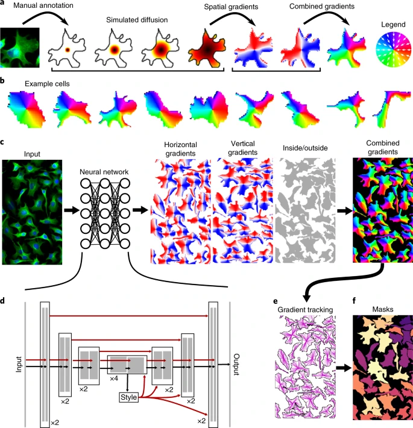
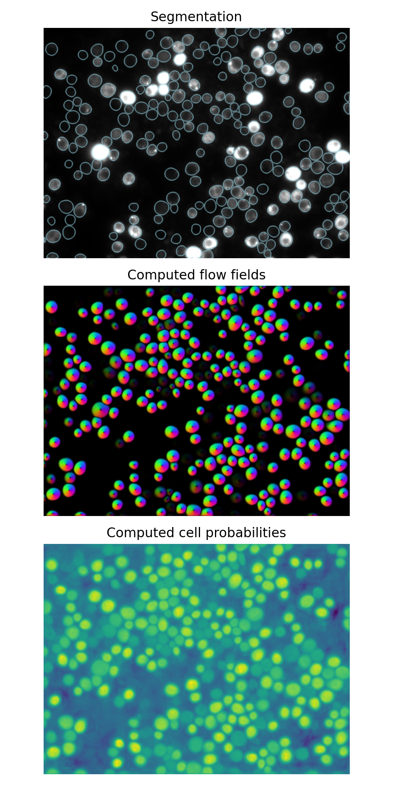

# Segmentation using Deep Learning

This section shows how Python can be used for deep learning based cell segmentation. Specifically, we will use the [Cellpose](https://www.cellpose.org/) model for segmentation.

## Cellpose

Cellpose is a generalist, deep learning-based algorithm for cellular segmentation. It is designed to work across a wide variety of cell types and imaging modalities without the need for extensive retraining (or any in most cases).



## Cellpose models

Cellpose provides pre-trained models that can be used for segmenting cells in images. The models are trained on a diverse set of images, making them versatile for various applications. The main models available are:

- **Cytoplasm model**: This model is designed to segment the cytoplasm of cells. It works well for images where the cytoplasm is clearly distinguishable from the background and other cellular components.
- **Nucleus model**: This model focuses on segmenting the nuclei of cells. It is particularly useful for images where the nuclei are prominent and can be easily identified.

## Cellpose parameters

When using Cellpose, there are several parameters that can be adjusted to optimize segmentation results:

- **Diameter**: This parameter controls the expected diameter of the cells to be segmented. It can be set to a specific value or left as `None` for automatic detection.
- **Model**: Users can choose between the cytoplasm and nucleus models depending on the type of cells being analyzed.
- **Flow threshold**: This parameter determines the minimum flow length for a contour to be considered valid. Higher values may result in fewer detected cells.
- **Cell probability threshold**: This threshold controls the minimum probability for a pixel to be classified as part of a cell. Adjusting this value can help reduce false positives.

## List of models

Cellpose offers several pre-trained models for different cell types and imaging conditions. The main models include:

- "cyto2": A model for general cytoplasm segmentation.
- "cyto3": An improved version for cytoplasm segmentation.
- "nuclei": A model specifically for nuclear segmentation.

## Example: Segmenting cells using Cellpose

Let's see how to use Cellpose for segmenting cells in an image. We will use the cytoplasm model for this example.

```Python
# import libraries
import numpy as np
import matplotlib.pyplot as plt
from cellpose import models
from skimage.io import imread
from iaf import imshow

# Load an example image
img = imread('data/fiji/segmentation/13901.tif')

# instantiate a Cellpose model for cytoplasm
model_cyto = models.CellposeModel(model_type='cyto3') # other options: 'nuclei', 'cyto2'
masks, flows, styles = model_cyto.eval(
    img,
    diameter=50,
    channels=[0, 0], # when using two channels: [cytoplasm, nucleus], this would be [1, 2]
    cellprob_threshold=0, # this is only set so that cellpose returns more output
    )

# Visualize the results
from scipy import ndimage
from skimage import segmentation

b = segmentation.find_boundaries(masks, mode='thick')
b = ndimage.binary_dilation(b, iterations=2)

plt.figure()
plt.imshow(img, cmap='gray')
plt.imshow(b, cmap='tab20', alpha=0.5 * b)
plt.title('Segmentation')

plt.figure()
plt.imshow(flows[0])
plt.title('Computed flow fields')

plt.figure()
plt.imshow(flows[2])
plt.colorbar()
plt.title('Computed cell probabilities')

```


