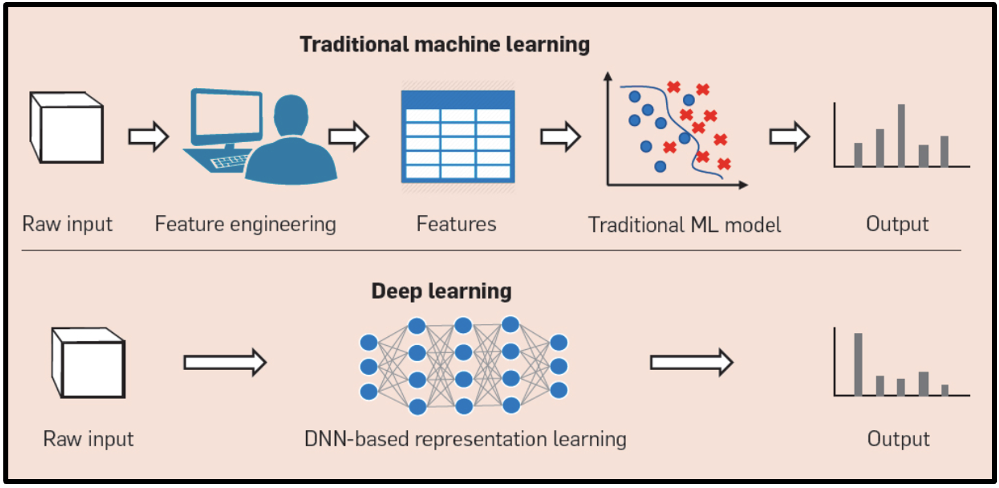
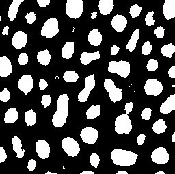

# 4. Segmentation Using Machine Learning

This section shows how Python can be used for machine learning based cell segmentation.

Machine learning based segmentation can be performed using "shallow" machine learning methods such as random forests, support vector machines, etc. These methods typically require feature engineering and are suitable for smaller datasets. Deep learning based segmentation, on the other hand, leverages neural networks with multiple layers to automatically learn features from data. Deep learning methods often require larger datasets and more computational resources but can achieve higher accuracy and generalization.




## Segmentation using "shallow" machine learning

Earlier we learned about the tool **Weka**, in Fiji/ImageJ which is a powerful plugin called "Trainable Weka Segmentation" that integrates the Weka machine learning toolkit with ImageJ/Fiji for image segmentation purposes. It allows users to perform pixel-based classification and segmentation of microscopy or other types of images by training machine learning classifiers directly on image data.

### References

* Rueden, C.T., Hiner, M.C., Evans, E.L. et al. PyImageJ: A library for integrating ImageJ and Python. Nat Methods 19, 1326–1327 (2022). https://doi.org/10.1038/s41592-022-01655-4


### Documentation

**Current documentation**: [https://py.imagej.net/en/latest/](https://py.imagej.net/en/latest/)

### Installation

To install `pyimagej` using `conda`, use:

```bash
$ conda install pyimagej
```

To install `pyimagej` using `pip`, use:

```bash
$ pip install pyimagej
```

### Working with ImageJ in Python

After loading the relevant libraries we initialize ImageJ with Fiji. This can take minutes to initialize depending on your hardware.

```Python
ij = imagej.init('sc.fiji:fiji')
```

Next, Weka segmentation can be initialized as follows
```Python
WekaSegmentation = scyjava.jimport('trainableSegmentation.WekaSegmentation')
```

Then we load an image. Note the image needs to be converted to ImagePlus (Java class) for compatibility with WekaSegmentation because ImageJ/Fiji is written in Java. 

```Python
image_path = 'https://imagej.net/images/blobs.gif'
img = ij.io().open(image_path)
imp = ij.py.to_imageplus(img)
```

Now to create a WekaSegmentation object with the image
```Python
weka = WekaSegmentation(imp)
```

Next we need a machine learning model. If you havn't saved one from the previous execises. Start ImageJ/Fiji. Open an image. Open the Weka Segmentation Plugin. Train the model. Save the model. Otherwise, load pre-trained classifier model (change to your .model file path)

```Python
classifier_path = r'classifier.model'
weka.loadClassifier(classifier_path)
```

To apply the classifier to image, arguments: (ImagePlus, threads=0 auto, getProbabilities=False) run the following line

```Python
result_imp = weka.applyClassifier(imp, 0, False)
```

We now get a result as an `ImagePlus` object. To continue with analysis in Python we first need to convert it back to a Python object.

```Python
img_py = ij.py.from_java(result_imp)

# Verify the type
print(type(img_py))

# Verify the shape
print(img_py.shape)
```

```
<class 'xarray.core.dataarray.DataArray'>
(3, 254, 256)
```

It is good practice to check the type and shape of the objects you are working with. We now see it is of type `xarray` and has has three channels. Inspecting the object shows:

```Python
img_py.head()
```
```
xarray.DataArray'Classification result'pln: 3row: 5col: 5

array([[[0, 0, 0, 0, 0],
        [0, 0, 0, 0, 0],
        [0, 0, 0, 0, 0],
        [0, 0, 0, 0, 0],
        [0, 0, 0, 0, 0]],

       [[0, 0, 0, 0, 0],
        [0, 0, 0, 0, 0],
        [0, 0, 0, 0, 0],
        [0, 0, 0, 0, 0],
        [0, 0, 0, 0, 0]],

       [[0, 0, 0, 0, 0],
        [0, 0, 0, 0, 0],
        [0, 0, 0, 0, 0],
        [0, 0, 0, 0, 0],
        [0, 0, 0, 0, 0]]], dtype=uint8)

Coordinates: 
pln (pln) float64 0.0 1.0 2.0
row (row) float64 0.0 1.0 2.0 3.0 4.0
col (col) float64 0.0 1.0 2.0 3.0 4.0

Indexes:
pln PandasIndex
row PandasIndex
col PandasIndex

Attributes: 
(0)
```

Now, typically we want to work with ndarrays. Therefore we convert to numpy array.

```Python
img_py_n = img_py.to_numpy()

# Verify the type
print(type(img_py))

# Verify the shape
print(img_py.shape)
```

```
<class 'numpy.ndarray'>
(3, 254, 256)
```

The typical format of RGB arrays with Python ndarray (usually from NumPy or other libraries) is a 3-dimensional array with shape:

```
(height, width, 3)
```
Here,

* The first dimension is the image height (number of rows of pixels).

* The second dimension is the image width (number of columns of pixels).

* The third dimension has size 3, representing the three color channels: Red, Green, and Blue, in that order.

Each element in the third dimension is usually an 8-bit unsigned integer (numpy.uint8) with values from 0 to 255 representing the intensity of the respective color channel for a given pixel.

For example, an RGB image of 100 pixels height and 200 pixels width could be represented as a NumPy array with shape `(100, 200, 3)`.

Now we see that we have to transpose the elements to bring our ML-based segmentation result into the corect shape.

```Python
img_py_n_t = img_py_n.transpose(1, 2, 0)

# Verify the type
print(type(img_py))

# Verify the shape
print(img_py.shape)
```
```
<class 'numpy.ndarray'>
(254, 256, 3)
```

We can now visualize it using e.g. the `imshow` function from `iaf`. 

```Python
imshow(img_py_n_t, auto_stretch=True)
```




Since we have basically a binary mask we can continue with only one channel

```Python
mask = img_py_n_t[:,:,0]
```

Using scipy we can now save this result for future use.

```python
from skimage.io import imsave

mask_uint8 = (mask).astype(np.uint8)

# Scale 0/1 to 0/255 for proper binary image display
mask_uint8  = mask_uint8  * 255

imsave('blobs_ml_segmetation_mask.png', binary_image)
```


## Segmentation using Deep Learning

This section shows how Python can be used for deep learning based cell segmentation. Specifically, we will use the [Cellpose](https://www.cellpose.org/) model for segmentation.

### Cellpose

Cellpose is a generalist, deep learning-based algorithm for cellular segmentation. It is designed to work across a wide variety of cell types and imaging modalities without the need for extensive retraining (or any in most cases).


### Cellpose models

Cellpose provides pre-trained models that can be used for segmenting cells in images. The models are trained on a diverse set of images, making them versatile for various applications. The main models available are:

- **Cytoplasm model**: This model is designed to segment the cytoplasm of cells. It works well for images where the cytoplasm is clearly distinguishable from the background and other cellular components.
- **Nucleus model**: This model focuses on segmenting the nuclei of cells. It is particularly useful for images where the nuclei are prominent and can be easily identified.

### Cellpose parameters

When using Cellpose, there are several parameters that can be adjusted to optimize segmentation results:

- **Diameter**: This parameter controls the expected diameter of the cells to be segmented. It can be set to a specific value or left as `None` for automatic detection.
- **Model**: Users can choose between the cytoplasm and nucleus models depending on the type of cells being analyzed.
- **Flow threshold**: This parameter determines the minimum flow length for a contour to be considered valid. Higher values may result in fewer detected cells.
- **Cell probability threshold**: This threshold controls the minimum probability for a pixel to be classified as part of a cell. Adjusting this value can help reduce false positives.

### List of models

Cellpose offers several pre-trained models for different cell types and imaging conditions. The main models include:

- "cyto2": A model for general cytoplasm segmentation.
- "cyto3": An improved version for cytoplasm segmentation.
- "nuclei": A model specifically for nuclear segmentation.

### Example: Segmenting cells using Cellpose

Let's see how to use Cellpose for segmenting cells in an image. We will use the cytoplasm model for this example.

```Python
# import libraries
import numpy as np
import matplotlib.pyplot as plt
from cellpose import models
from skimage.io import imread
from iaf import imshow

# Load an example image
img = imread('data/fiji/segmentation/13901.tif')

# instantiate a Cellpose model for cytoplasm
model_cyto = models.CellposeModel(model_type='cyto3') # other options: 'nuclei', 'cyto2'
masks, flows, styles = model_cyto.eval(
    img,
    diameter=50,
    channels=[0, 0], # when using two channels: [cytoplasm, nucleus], this would be [1, 2]
    cellprob_threshold=0, # this is only set so that cellpose returns more output
    )

# Visualize the results
from scipy import ndimage
from skimage import segmentation

b = segmentation.find_boundaries(masks, mode='thick')
b = ndimage.binary_dilation(b, iterations=2)

plt.figure()
plt.imshow(img, cmap='gray')
plt.imshow(b, cmap='tab20', alpha=0.5 * b)
plt.title('Segmentation')

plt.figure()
plt.imshow(flows[0])
plt.title('Computed flow fields')

plt.figure()
plt.imshow(flows[2])
plt.colorbar()
plt.title('Computed cell probabilities')

```


